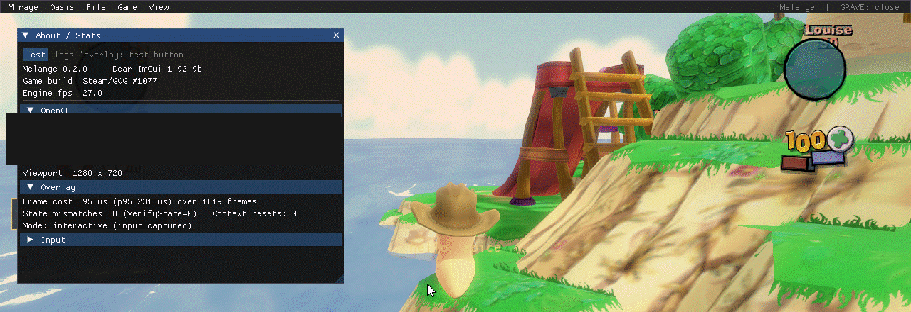

# Melange

**A modding framework for Worms Ultimate Mayhem.**

Melange fixes long-standing multiplayer bugs and lets you install mods: new weapons, graphics effects, shaders, scripts and tools. It works with the Steam version of the game (build #1077) and switches itself off on any other build.

## Install Melange

1. Download the latest `melange-*.zip` from [Releases](https://github.com/JaminB/melange/releases) and extract it.
2. Run `Melange.exe`. It will guide you to your game folder, check the build, and install or update Melange.
3. Start the game. The window title shows `[Melange x.y.z]`.

**Melange keeps itself up to date.** Each time you open `Melange.exe`, it asks GitHub for the latest release. When there is a newer one, it downloads it in the background, checks its SHA-256 and that it is signed by the same publisher, and shows *Melange x.y.z is ready — Restart to update*. One click closes Melange, installs the update into your game folder (with a backup, like any install), and opens the new version. Close the game first. *Settings › Updates › Check for updates* looks again on demand. The game itself looks at most once a day and only says when a newer version is out. *Settings › Updates › Check for updates automatically* turns off both the check at start and the game's (it writes `CheckInGame=0` under `[Update]` in `Melange.ini`); *Check for updates* still works. Each check is a plain HTTPS `GET` to GitHub that sends nothing about you or your game.

**Undo:** Delete the `Melange.exe` copy in your game folder, `melange.asi`, `Melange.ini` and the `Melange` and `Mods` folders. Delete `dinput8.dll` too, unless other ASI mods still need it. Melange keeps a backup of anything it replaces on Home › Settings › Melange › Backups.

Releases are code-signed; see [Code signing](CODE_SIGNING.md).

## Install a mod

The easy way is the Store: on Melange.exe's **Plugins** page press *Open Store* (in the game: *Store* on the *Thumper/Mods* page, or the **Store** panel in Oasis), pick a plugin and press *Install*. The Store contacts GitHub only when you open it, and sends nothing about you or your game. Some plugins, like Caravan, import maps from a download onto your PC.

To install a mod by hand (a "local" plugin):

1. Put the mod's folder in `<game>\Mods\`, so that you have `<game>\Mods\<mod>\spice.json`.
2. Start the game and press `` ` `` to open the overlay.
3. On the *Thumper/Mods* page, tick *Show local plugins* and switch the mod on. Mods that change gameplay take effect the next time you start the game.

Good to know:

- **Local plugins are hidden by default.** The Plugins and Mods pages list what you installed from the Store; *Show local plugins* lists the rest too, with a *Store* or *Local* badge. Hidden plugins still load if they are switched on.
- **Plugins that can't load are set aside.** When Melange starts (Melange.exe or the game) and finds a plugin that this version of Melange can never load (its `spice.json` asks for another Melange version, or is broken), it doesn't leave it lying around: a Store plugin is updated to a version that works, or removed if there is none; a local one is moved to `<game>\Mods\.incompatible\`. The Plugins and Mods pages say what happened, until you dismiss it. Only then may Melange.exe contact GitHub without you opening the Store: to look for that update.
- **Online play:** everyone in a match needs the same gameplay mods. Mods that only change your screen, such as effects and UI, don't matter to other players.
- **Permissions:** a mod that asks for raw access to the game's memory ("Deep Desert") shows a consent dialog first. Only allow mods you trust.
- **Samples:** `dist\Mods\` has example mods, all switched off. Copy one into `<game>\Mods\` to try it (tick *Show local plugins* to see it).

## Uninstall

Melange.exe's *Settings › Melange › Uninstall* removes Melange and keeps a backup. Or delete `melange.asi`, `Melange.ini` and the `Melange` and `Mods` folders from the game folder yourself. Delete `dinput8.dll` too, unless other `.asi` mods still need it.

To get the plain game back, *Settings › Restore vanilla* makes the game folder stock Worms Ultimate Mayhem again. It deletes, for good, every file that isn't part of the game: Melange, and also other mods such as Renewation HD, WUMPatch, ReShade, ASI loaders and plugins. The dialog names everything it found before you confirm. Your saves (kept by Steam, outside the game folder), `local.cfg` and the game's own caches and logs stay. Replays move to `Documents\Melange\replays`. If a mod had overwritten game files, Steam verifies the game afterwards (on GOG, verify in GOG Galaxy or reinstall). Melange then closes. The next time you open it, setup starts from the beginning.

## Reporting a bug

Press `Ctrl+Shift+F11` in the game (or *File > Export last game's logs* in the overlay), or click *Export last game's logs* on Melange.exe's *Help* page after the game has closed. It saves `Melange-logs-<date>-<time>.zip` to your Desktop in one click: that game's logs, match recordings and desync bundles. Attach the zip to your report. User names are removed, and Steam IDs and IP addresses are hashed.

## For developers

- [Creating a plugin](docs/creating-plugins.md): write your first mod or C++ module.
- [Developer guide](docs/developer-guide.md): settings, logs, the SDK and every subsystem, and building from source.
- [Map editor (Erg)](docs/erg.md): build, test and share your own Versus maps from Oasis.

## License

[MIT](LICENSE). Melange is an unofficial fan project, not affiliated with or endorsed by Team17. You need your own copy of Worms Ultimate Mayhem.
