# Melange developer guide

How Melange works for mod and module authors: settings, logs, the SDK, and each subsystem. To write your first mod or module, start with [Creating a plugin](creating-plugins.md).

| Topic | Reference |
|---|---|
| Mod manifest (`spice.json`) | [spice.md](spice.md) |
| Lua API (`wum.*`) | [lua-api.md](lua-api.md) |
| Weapon clones | [weapons.md](weapons.md) |
| Oasis web app | [oasis.md](oasis.md) |
| Replays and desync detection | [wormsign.md](wormsign.md) |
| Map editor (Erg) | [erg.md](erg.md) |
| `xomtool` | [xomtool.md](xomtool.md) |
| Frame capture format | [capture-format.md](capture-format.md) |

## Configuration

Every module has its own section in `Melange.ini`, and `Enabled=0` turns a module off. Missing keys are added with their default values the first time the game runs.


| Module | Default | What it does |
|---|---|---|
| `NetTransport` | on | Retransmits any lost packet, and re-acknowledges duplicates so a lost ACK can't stall the peer |
| `NetSession` | on | Resets the match state the game leaves behind, and traces the match lifecycle |
| `Fixes` | on | Fixes crashes in the game itself, one switch each: closing the game after an online or LAN session (`NetServiceExit`) or during or after a match (`AiServiceExit`), and the `/SEPIA` launch option crashing at startup (`SepiaSwitch`); build #1077 only |
| `Diagnostics` | on | Crash handler, hang watchdog and minidumps |
| `Overlay` | on | The in-game overlay (`ToggleKey`, `PassthroughKey`) |
| `EventBus` | on | The engine message bus for modules |
| `Logging` | on | Structured JSONL session logs |
| `LogExport` | on | "Save logs" zip export (`Hotkey`) |
| `EngineLog` | on | Copies the engine's own log into `Melange.log` |
| `SteamTrace` | on | Logs Steam lobby, P2P and callback activity |
| `NetTrace` | on | Logs raw Winsock calls |
| `WindowTag` | on | Shows the Melange version in the window title |
| `FrameInterval` | on | Sets the engine frame interval (`IntervalMs=16` is about 60 fps); "Classic timing" (`ClassicTiming=0`) raises the OS timer resolution to 1 ms (`timeBeginPeriod`) for steadier pacing on systems that stutter at the default resolution. Toggle in the overlay menu *Game* |
| `SmoothSixty` | on (`On=0`) | "Smooth 60": lifts the engine's frame limiter and uses vsync. Toggle in the overlay menu *Game* |
| `Mirage` | on | Graphics layer core: renderer access, scene stages for mods, mod folders |
| `MirageTrace` | on | OpenGL call statistics (`Mode=count`), frame capture (`CaptureHotkey`), texture dumper, GPU compatibility report |
| `MirageShaders` | on | Shader mods: replacements, patches, live reload, sliders; fixes the game's FXAA on AMD and Intel (`FixFxaa`) |
| `MiragePostFX` | on | Post-processing effects from mods, applied to the world or the whole frame (`ToggleKey` bypasses them) |
| `MirageDraw` | on | Drawing API for modules: world-space lines, boxes, spheres and text, and HUD shapes, text and images |
| `MirageDebug` | off | OpenGL debug context: driver errors and warnings go to the logs and the *Mirage/GL debug* panel |
| `LuaConsole` | on | Overlay Lua REPL (`Ctrl+Shift+F10`, *Lua/Console*) for the client VM and, in a match, the match VM (off online unless `MatchConsoleOnline=1`) |
| `GameState` | on | Read-only game-state readers for Oasis and `wum.game.worms()` (worms, teams, match values, entities); build #1077 only |
| `Levels` | on | Map packs from content mods, Erg Test levels and the online map gate (`Online`, `RandomPool`, `DevWater`); installs nothing until a mod map or a Test level exists; build #1077 only |
| `Store` | on | The plugin store (*Thumper/Store*, the Oasis Store panel): fetches the list only when you open it ([Plugin store](#plugin-store)) |
| `Oasis` | on | The local web app on 127.0.0.1 ([oasis.md](oasis.md)); nothing listens until you open it |
| `Wormsign` | on | The match's tick clock and a per-tick state hash (`wum.wormsign.tick()`); records a rolling library of recent matches to `Documents\Melange\replays` (last 20 / 200 MB by default, `wum.wormsign.library()`), match replays checked tick by tick (*Wormsign/Replay*); online, it compares the hashes with other Melange players and reports the first tick where they disagree ([wormsign.md](wormsign.md)); build #1077 only |

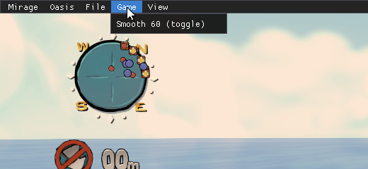

## Logs and bug reports

| Where | What |
|---|---|
| `<game>\Melange\Melange.log` | Plain-text log of the current run (`Melange.prev.log` is the run before) |
| `<game>\Melange\dumps\` | Crash and hang minidumps |
| `Documents\Melange\logs\<session>\` | Structured session log (`events.jsonl`) |
| `Documents\Melange\replays\desync-*.zip` | Desync bundles: what differed between two players, and at which tick |

To report a bug, press `Ctrl+Shift+F11` in the game, or choose *File > Save logs as...* in the overlay, and attach the zip (it includes the newest desync bundle). In fullscreen, the zip goes to `Documents\Melange\exports` instead of opening a save dialog.

The zip includes a GPU compatibility report (`gpu/compat.txt`): graphics card, driver, OpenGL version and extensions, the Cg shader profiles your card supports, and which shaders and effects loaded or were skipped and why. The overlay panel *Mirage/GPU* shows the same report.

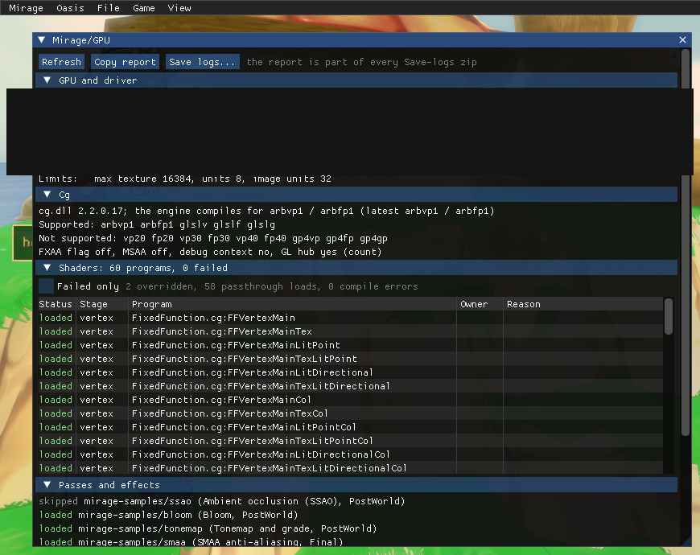

## Graphics layer (Mirage)

Mirage lets modules and mods draw inside the game's own frame. `melange/render.h` gives the main camera, window size and frame timing, and runs callbacks at fixed points of the engine's draw list:

| Stage | Where it runs |
|---|---|
| `World` | after the landscape, sea and worms, before particles (the depth buffer holds the world) |
| `WorldLate` | after particles, before worm labels and the HUD |
| `PostWorld` | same point, after the `WorldLate` callbacks: post-processing that leaves labels and HUD alone |
| `Hud` | after the HUD, before the final copy to the screen |
| `Final` | just before the final copy to the screen |

Callbacks run in the main render pass only, with the game's framebuffer bound. Wrap your GL work in `render::PushState()` / `PopState()`. With no stage callbacks or mods asking for one, the scene stages themselves patch nothing and the frame is pixel-identical to the game without Mirage. The GL trace hub is separate and installs its call-counting thunks whenever `[MirageTrace] Mode` is `count` (the default) or `log`; set it to `off` for a frame with no Mirage hooks at all.

| `MirageDraw` demo off | `MirageDraw` demo on |
|---|---|
| 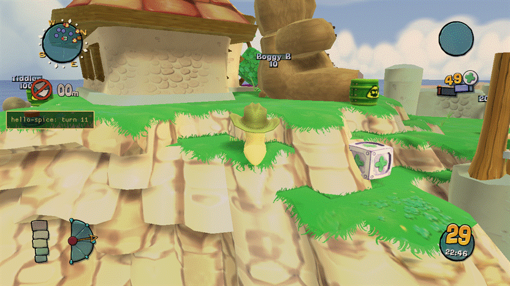 | 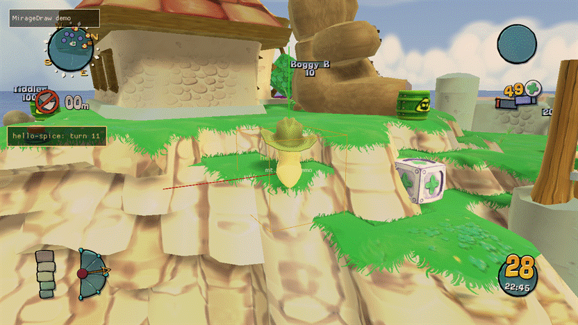 |

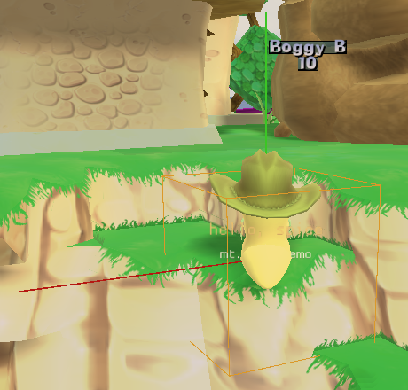

Mods live in `<game>\Mods\<id>\`. When two mods provide the same file, the later folder name wins. `[Mirage] DisabledMods=a,b` switches mods off, and `ModsDir` moves the folder.

### GL trace and frame capture

`MirageTrace` counts every OpenGL call the game and its Cg runtime make. The overlay panel *Mirage/GL* shows calls, draw calls, shader switches and frame time per frame, and the busiest functions. `[MirageTrace] Mode` is `count` (the default: one counter per call), `log` (records every call), or `off` (no hooks at all; switching back needs a restart).

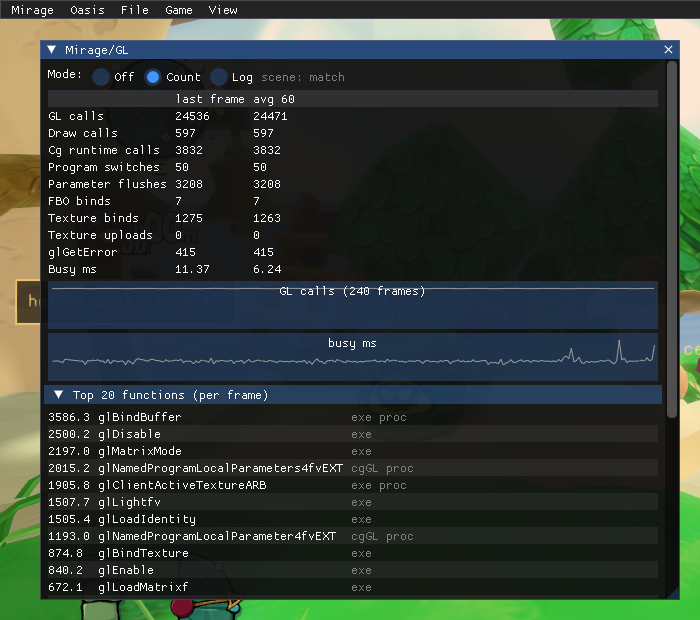

*Capture frame* (or `Ctrl+Shift+F9`) records one frame into `Documents\Melange\captures\*.mcap`: every call with decoded arguments, the GL state, the compiled shaders, the bound textures and the final image. The format is a plain zip, described in [capture-format.md](capture-format.md). *Dump next 50 textures* writes the next textures the game loads to `Documents\Melange\textures\` as PNG. Captures and dumps contain the game's textures, so they stay on your PC and are never part of a logs export.

### GPU timers

`[Mirage] GpuTimers=1` (the default) brackets the swap-to-swap frame and each stage in the table above with a pair of
GPU timestamp queries (only stages with at least one registered callback are timed that frame). The *Mirage/GL*
panel's *GPU timers* section lists them, and `melange::gltrace::GetGpuTime(GpuRegion)` (`melange/gltrace.h`) reads
them from C++; the `gltrace.gpu` console verb logs all six at once. A region reads `n/a` until its first result has
come back from the GPU (the queries are triple-buffered, so that's normally a couple of frames). This is separate
from Post-FX's own per-effect timers (`melange::postfx::EffectInfo::gpuMs`, shown in *Mirage/Post-FX*): these time
Mirage's own stage machinery and mod callbacks, not any one effect.

### Shader mods

The game's shaders are the Cg files in `<game>\CG\`. A mod changes them from its `shaders\` folder, without shipping the game's files:

- `shaders\<file>` replaces a whole file, such as `Landscape.cg`, or a file it includes, such as `Fxaa3_9.h`.
- `shaders\<file>.patch` edits the game's file with find/replace blocks. Each `find` block must match exactly once; otherwise the patch is skipped and the error is logged. An optional first line `@@ entry <pattern>` limits the patch to some programs (`*` and `?` wildcards).

  ```
  @@ entry *FragmentMain
  @@ find
  	const float specularPower = 20.0f;
  @@ replace
  	const float specularPower = 40.0f;
  @@ end
  ```
- `shaders\params.ini` turns uniforms into sliders in the overlay's *Mirage/Shaders* panel. A section names the file and the programs, `[Landscape.cg:*FragmentMain]`, and each line is `name=type,default,min,max,label` with the type `float`, `vec2`, `vec3`, `vec4` or `color`. Modules set the same values with `melange::shaders::SetParam`, and add folders of shader files with `AddOverrideRoot`.

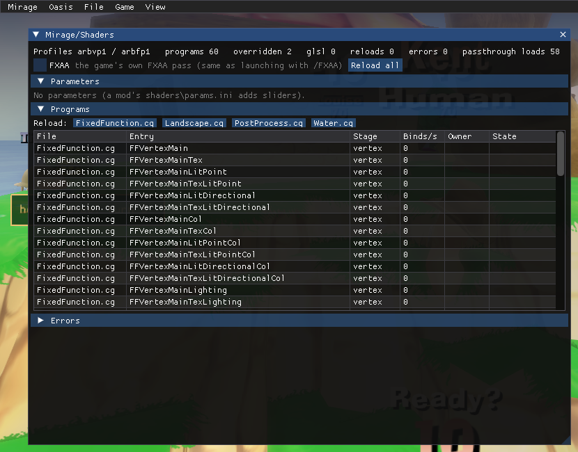

Saving a file reloads the shaders that use it while the game runs. The new source is compiled first: if it has errors, the game keeps the running shader, and the errors go to the log and the panel.

`[MirageShaders] FixFxaa=1` (the default) fixes the game's own FXAA pass (the `/FXAA` launch option), which does not compile on AMD and Intel GPUs. The panel also switches FXAA on and off while the game runs.

| `FixFxaa` off | `FixFxaa` on |
|---|---|
| 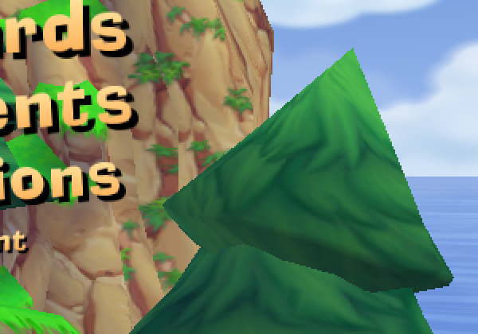 | 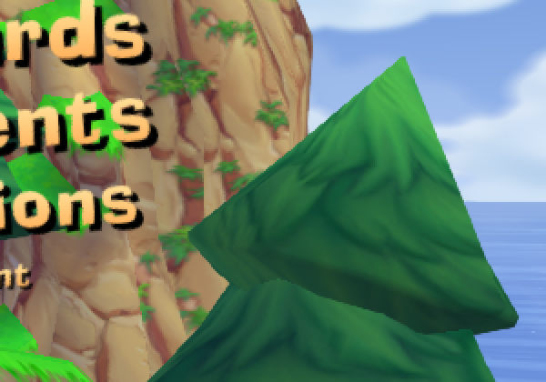 |

`Mods\mirage-landscape\` is a sample: it adds tunables to the landscape lighting and softens the shadow edges. It is listed in `DisabledMods` by default; remove it from that list to try it. Experimental: a file `shaders\<File>.<Entry>.glsl` replaces one program with GLSL, keeping the Cg parameter names (`GlslReplace=1`, read at start). `Mods\mirage-landscape\extras\` has a GLSL version of the landscape pixel shader. Each GLSL replacement can be switched off at runtime, no restart needed: the *Mirage/Shaders* panel's *GLSL* column checkbox (shown whenever a replacement file exists for that program), or `melange::shaders::SetGlslEnabled(file, entry, on)`. The choice is persisted to `[MirageShaders] GlslDisabled`.

### Texture clarity

`MirageTextures` applies 16x anisotropic filtering, a trilinear minification filter and an optional negative LOD
bias at the engine's own texture uploads. It changes nothing by default (vanilla filtering): a client-only mod asks
for it through its `spice.json`'s `graphics` block,

```json
"graphics": { "anisotropy": 16, "trilinearFilter": true, "lodBias": -0.25 }
```

and `[MirageTextures]` in `Melange.ini` always has the final say over every enabled mod's request:

```ini
[MirageTextures]
Anisotropy=auto   ; auto | an integer 0-16
Trilinear=auto    ; auto | on | off
LodBias=auto      ; auto | a number from -8 to 8
```

`auto` follows the strongest merged request among enabled mods (the highest anisotropy, trilinear if any mod wants
it, the sharpest requested LOD bias), or vanilla if none ask for it. Enabling or disabling a requesting mod applies
at once: every texture seen so far is swept back to the new effective settings. The `mirage.textures` console verb
logs the effective settings, whether the upload hook is installed, and how many textures it has touched. The
`sunstone` plugin ships this layer.

### Shadows

The game renders one shadow map for the whole level, 1024² by default (its own `/SHADOWMAP` cfg option). A
client-only mod asks for a larger one in the same `graphics` block, and `MirageShadows` applies the largest request
among enabled mods:

```json
"graphics": { "shadowMapSize": 2048 }
```

The size is 512, 1024, 2048 or 4096. Nothing changes unless a mod asks for it. `[MirageShadows]` in `Melange.ini`
always has the final say:

```ini
[MirageShadows]
ShadowMapSize=auto   ; auto | vanilla | 512 | 1024 | 2048 | 4096
```

A request known at start is applied before the game creates its shadow map. Enabling or disabling a mod, or a
script's `wum.graphics.setShadowMapSize`, rebuilds the shadow map once on the next frame; going back to no request
restores the game's own size. The `mirage.shadows` console verb logs the effective, vanilla and current sizes.

Filtering is up to the landscape shader. A GLSL replacement (`shaders\Landscape.LandscapeFragmentMain.glsl` and
`Landscape.HeightMapFragmentMain.glsl`) samples `shadowMap` as a `sampler2DShadow` (hardware depth compare with
bilinear filtering) and gets the map size in `shadowSize`. Its own tunables are uniforms with no Cg parameter: declare
them in the mod's `shaders\params.ini` and Melange feeds them the slider values (`float`, `vec2`, `vec3`, `vec4`).
A script changes them with `wum.shaders.setParam`, and pauses or resumes its own replacements with
`wum.shaders.enableGlsl`. A replacement can also read the other stage's Cg parameters by their Cg name: a fragment
replacement that declares `uniform mat4 view;` gets the vertex program's `view` matrix (Cg rows become GLSL columns,
so `view[1].xyz` is the world's up axis in eye space). The `sunstone` plugin uses this for its soft shadows and
lighting.

### Post-processing effects

An effect is a folder `<game>\Mods\<id>\postfx\<effect>\` with an `effect.ini` and GLSL fragment shaders. Its id is `<id>/<effect>`. Effects run at one of two stages:

- `PostWorld` changes the world only: worm labels and the HUD are drawn on top afterwards.
- `Final` changes the whole frame, just before the game copies it to the screen. The game's own FXAA and sepia still apply afterwards.

Open the overlay's *Mirage/Post-FX* panel to switch effects on, change their order, drag their parameters and see what each one costs on the GPU. *Split compare* shows the left half of the screen without the effects. `Ctrl+Shift+F8` (`[MiragePostFX] ToggleKey`) bypasses the whole stack. Your choices are saved in `[MiragePostFX]` in `Melange.ini`. Editing an effect's files while the game runs reloads it. A shader that fails to compile is reported in the panel and the log, and the other effects keep running.

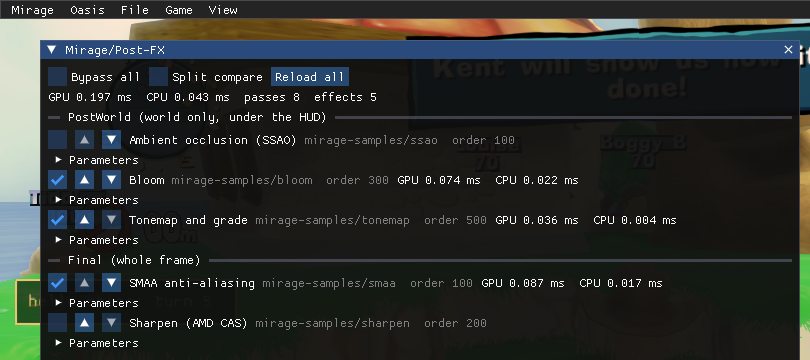

```ini
[effect]
title=Bloom
stage=PostWorld          ; PostWorld | Final
order=300                ; lower runs first; ties by id
enabled=0                ; the default until the player changes it

[param.threshold]        ; uniform float p_threshold
type=float               ; float | vec2 | vec3 | color | int | bool
default=0.8
min=0
max=2
label=Threshold

[texture.lut]            ; uniform sampler2D t_lut, a PNG from the effect folder
file=lut.png
filter=linear            ; linear | nearest
wrap=clamp               ; clamp | repeat

[pass.extract]
shader=extract.frag
scale=0.5                ; size relative to the scene
format=rgba16f           ; rgba8 | rgba16f | r8 | rg8
inputs=scene             ; scene, depth, prev, pass.<name>, texture.<name>

[pass.blurh]
shader=blur.frag
defines=HORIZONTAL=1     ; prepended as #define lines
scale=0.5
inputs=prev

[pass.combine]           ; the last pass writes the effect's output at scene size
shader=combine.frag
inputs=scene,pass.blurh
```

Shader rules:

- Fragment shaders only. The file's own `#version` is used, or `#version 120` if there is none. Mirage supplies a full-screen vertex shader that writes `vec2 mg_uv` (0..1, origin bottom-left). Declare it as `varying vec2 mg_uv;` in GLSL 1.20, or `in vec2 mg_uv;` in 1.30 and later.
- Samplers are named after the inputs: `mg_scene`, `mg_depth`, `mg_prev` (the previous pass, or the scene for the first pass), `mg_pass_<name>` and `t_<name>`. Every sampler a shader uses must be listed in that pass's `inputs=`.
- `mg_depth` is the game's depth buffer, in [0,1] as stored.
- Parameters are `uniform <type> p_<name>`. Optional built-in uniforms:
  - `vec4 mg_resolution`: width, height, 1/width and 1/height of this pass's target;
  - `vec4 mg_sceneResolution`: the same for the scene;
  - `float mg_time`, `float mg_frame`;
  - `mat4 mg_proj`, `mat4 mg_invProj`, `mat4 mg_view`: the main camera;
  - `vec2 mg_nearFar`: the near and far clip distances.
- `#include "file"` pastes a file from the effect folder.
- Textures are uploaded top row first, so `v = 0` is the top row of the PNG.

C++ modules can add a pass of their own with `postfx::AddCodePass`. It draws a full-screen pass that reads `ctx.srcColor` (and `ctx.srcDepth`) into the framebuffer already bound.

The `mirage-samples` mod in `dist\Mods\` has five example effects, all switched off by default:

| Effect | Stage | What it does |
|---|---|---|
| `smaa` | Final | SMAA 1x anti-aliasing ([iryoku/smaa](https://github.com/iryoku/smaa), MIT). Use it instead of `/FXAA`, not with it. |
| `sharpen` | Final | AMD FidelityFX Contrast Adaptive Sharpening ([FidelityFX-CAS](https://github.com/GPUOpen-Effects/FidelityFX-CAS), MIT) |
| `ssao` | PostWorld | Ambient occlusion from the depth buffer |
| `bloom` | PostWorld | Glow around bright areas |
| `tonemap` | PostWorld | A filmic curve plus exposure, contrast, saturation and a colour-grading LUT (`lut.png`) |

| `ssao` off | `ssao` on |
|---|---|
| 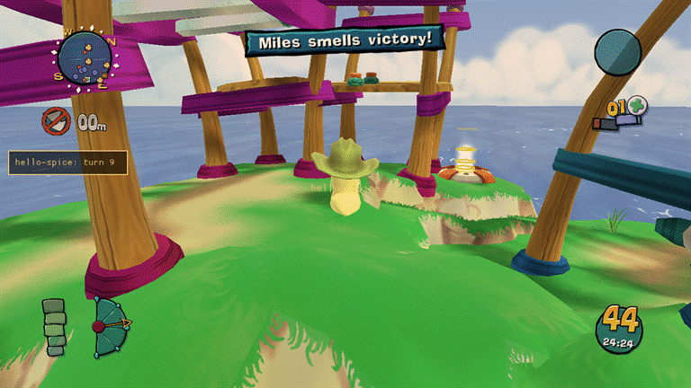 | 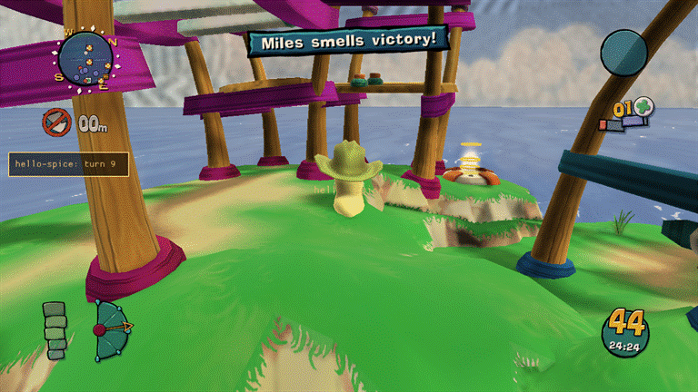 |

| `bloom` off | `bloom` on |
|---|---|
| 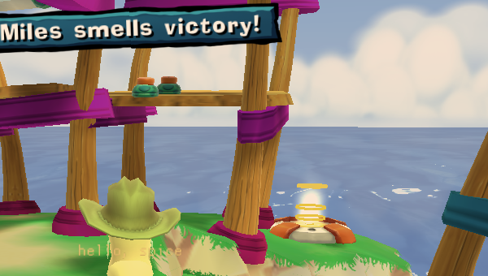 | 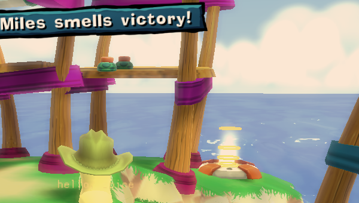 |

| `tonemap` off | `tonemap` on |
|---|---|
| 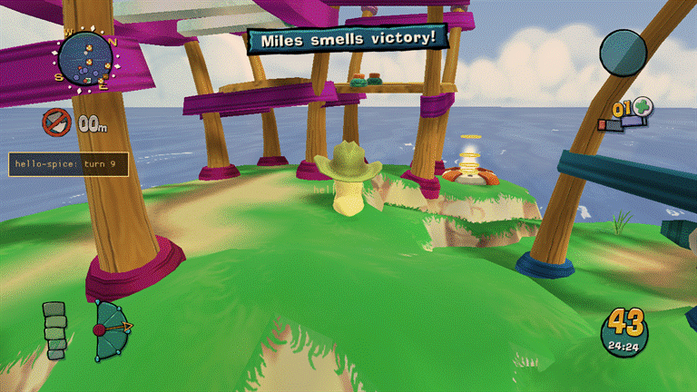 | 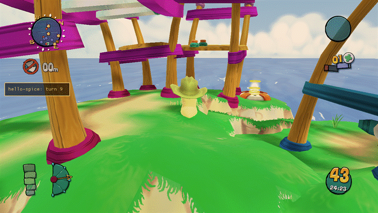 |

| `smaa` off | `smaa` on |
|---|---|
|  | 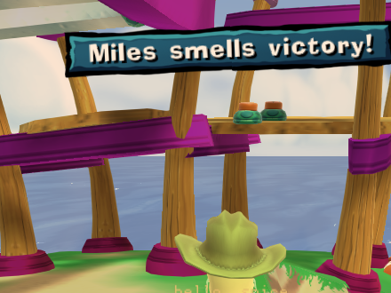 |

The SMAA and CAS folders carry their licence files.

## Mods (Thumper)

Thumper discovers mods under `<game>\Mods\<id>\`. A folder with a `spice.json` manifest is a Spice mod
(schema in [spice.md](spice.md), machine-readable as [spice-1.schema.json](spice-1.schema.json));
a folder without one still loads, unchanged, as a client-only mod named after its folder — older
`Mods\` folders with only shaders or post-FX keep working unchanged.

```json
{
  "spiceVersion": 1, "id": "hello-spice", "version": "1.0.0", "name": "Hello Spice",
  "melange": { "range": ">=0.3.0 <0.4.0" }, "kind": "client-only",
  "entry": { "client": "client/init.lua" }
}
```

- **`kind`** is `client-only` (never touches the simulation or the wire) or `content` (adds simulation
  behaviour or engine message names; must match on every peer in an online match).
- **Dependencies, conflicts and load order** come from `dependencies`, `optional`, `conflicts` and
  `loadAfter`, each a mod id with an optional semver range (`weapon-toolkit >=2.0.0 <3.0.0`). A missing
  or version-mismatched dependency blocks the mod and names the fix; a dependency on a blocked mod is
  blocked too ("blocked because X is blocked"); a cycle blocks every mod in it with one shared reason.
  Ties between mods with no ordering edge between them are broken by id, ascending — the same input
  always resolves to the same order.
- **`permissions.unsafe: true`** asks for Deep Desert: raw memory read/write and calling game functions
  from `wum.unsafe` (client VM only). Enabling such a mod opens a consent modal; declining still loads
  the mod, just with `wum.unsafe` raising instead of working. A small "Deep Desert active" marker stays
  on screen, even with the overlay hidden, while any granted unsafe mod is enabled.
- **Client-only mods toggle live.** A content mod's message names are registered once per launch and
  never unregistered, so enabling or disabling one takes effect at the next launch (the Mods page shows
  "restart required" until then). The exception is a pack of maps only, which can change live at the main menu
  (see [Map editor](#map-editor-erg)).
- Choices are saved to `Mods\thumper-state.json` (falling back to `Documents\Melange` if the game folder
  is read-only). The overlay's *Thumper/Mods* panel lists every mod with its state and reason, and
  *Thumper/Deep Desert* lists every grant.

`dist\Mods\` includes `hello-spice` and `sim-sampler` as disabled samples (`defaultEnabled: false`); a
newly discovered mod without that flag starts enabled.

## Plugin store

The Store installs mods from a curated list, the [melange-plugins](https://github.com/JaminB/melange-plugins)
repository: every plugin there was reviewed in a pull request, its release zip was packed by that repository's own
workflow, and the list pins each zip's SHA-256. Open *Thumper/Store* in the overlay (or the *Store* button on
*Thumper/Mods*), or the **Store** panel in Oasis.

- **Privacy.** The list is fetched from GitHub only when a Store page opens or you press *Refresh*; screenshots only
  when you open a plugin's details; a zip only when you install it. Nothing runs at start-up or on a timer, and
  nothing about you or your game is sent: the requests are plain HTTPS `GET`s with the user agent `Melange/<version>`
  and no cookies, credentials or query strings. GitHub sees your IP address, as with any download.
- **What an install does.** The zip is downloaded to `Mods\.store\dl\`, its length and SHA-256 must match the list,
  every entry is checked before a byte is written (no absolute or `..` paths, links, device names, hidden files,
  executables, or entries larger than they claim), and it is unpacked into `Mods\.store\stage\`. Its `spice.json`
  must name the same id, version, kind and permissions as the listing (a zip cannot ask for more than its listing
  showed). Only then is the folder moved into `Mods\<id>\` in one rename. Any failure leaves `Mods\` as it was.
- **When changes apply.** Client-only plugins install, update and remove live. A content plugin that is active this
  session is updated or removed at the next launch ("Applies at the next launch"); a new content plugin installs now
  and shows *restart required*, as enabling one does. Installs, updates and removes are refused in a lobby, a network
  game or a match, while a level loads and while an Erg Test runs; browsing and *Refresh* always work.
- **Deep Desert.** A plugin that asks for it says so before anything is downloaded, runs sandboxed until you allow
  it in the overlay's consent prompt, and asks again after every update. Oasis can never grant it.
- **Your data.** Settings (`[Mod.<id>]` in `Melange.ini`), saved data and `Mods\<id>\user\` are kept across
  updates. *Remove* keeps them unless you tick "Also delete its settings and saved data".
- **Older versions and withdrawn ones.** An older version is never installed by itself: *Details > Versions* offers
  *Install this version* with a confirm. A version the list marks as withdrawn is never offered. If a fetched list
  is older than one seen before, updates and installs are disabled until a newer list arrives.
- A mod you put in `Mods\` by hand shows as "Installed manually"; the Store replaces it only after a confirm, and
  never removes it.

`[Store]` in `Melange.ini`:

| Key | Default | Meaning |
|---|---|---|
| `Enabled` | `1` | `0`: no Store pages, no methods, no network code. |
| `IndexUrl` | the melange-plugins list on GitHub | For testing a list of your own: `https://` or `file:///C:/...` (then zips and screenshots may be `file:///` too). Anything else is refused and the default is used. A custom list shows a yellow "Custom index" line on both pages. |
| `MaxDownloadMB` | `64` | The largest zip the Store downloads (1-256). |
| `ShowIncompatible` | `0` | Also list plugins with no version for this Melange or game build, with the reason. |

The Store keeps its files in `Mods\.store\` (Thumper ignores folders that start with a dot): `installed.json` (what
it installed, by version and hash), the last fetched list for offline display, a screenshot cache, and
`pending.json` for changes waiting for the next launch. Deleting the folder makes every plugin count as manually
installed. To publish a plugin, see the melange-plugins repository's `CONTRIBUTING.md`; `tools/store.py pack` there
builds the exact zip the Store will install, so you can drop it into `Mods\` and test it first.

## Lua scripting

A mod folder can carry a Lua 5.4 script for the client side, named by `entry.client` in its `spice.json`. Melange runs it in the Sandbox: each mod has its own globals, the standard library is limited (no files, no `load`, no `debug`), and a runaway script is stopped by an instruction and memory budget without stopping the game. Scripts reach the game through the `wum` table: engine and mod events, timers, settings, per-mod storage, overlay panels, world and HUD drawing, the camera, and post-FX parameters. When a script file changes, the mod reloads; if the new version fails, the old one keeps running. The full reference is [lua-api.md](lua-api.md).

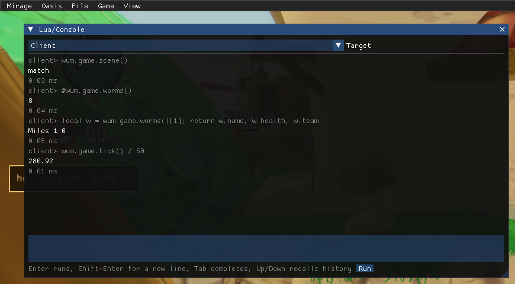

Two sample mods in `dist\Mods\` ship switched off:

| Mod | What it shows |
|---|---|
| `hello-spice` | Events, logging, a HUD widget, a world label, an overlay panel with a setting, timers, storage and hot reload |
| `deep-desert-demo` | The Deep Desert permission: with the player's consent it reads the game's build stamp through `wum.unsafe` |

| Before hello-spice loads | After hello-spice runs |
|---|---|
| 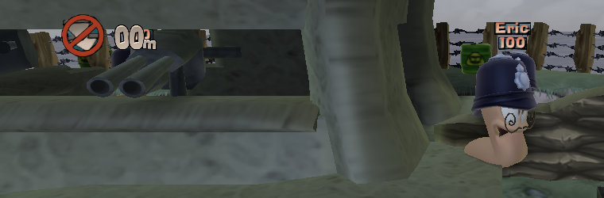 | 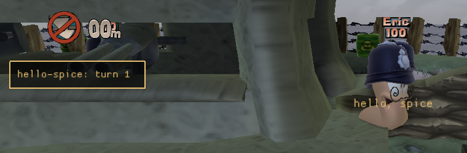 |

`wum.unsafe` (raw memory reads and writes, native calls) exists only for mods whose manifest asks for it, and raises an error until the player allows it.

## Weapon mods

A `kind: "content"` mod can add up to 3 **weapon clones**: a new, independently named weapon that reuses one of
a handful of vanilla weapons' own code and stats, with its own icon and Lua behaviour. Add a `weapons` array to
`spice.json` (schema: [spice-1.schema.json](spice-1.schema.json)), react to its events with
`wum.sim.weapons` from `entry.sim`, and it shows in the weapon panel with no other wiring. The full field
reference, the base whitelist, the Lua events and what does and doesn't work yet are in
[weapons.md](weapons.md); `dist\Mods\mega-bazooka` (shipped disabled) is a complete example: an
oversized Bazooka with a bigger blast and three extra explosions.

## Sieve (`xomtool`)

The game's data files (weapon stats, meshes, textures, sound banks) are one container format, `.xom`. Sieve is
Melange's toolchain for it: a portable C++/Python reader-writer library (already used by Melange itself for
weapon field offsets and types) and a command-line tool, `xomtool` (built into `dist/tools/xomtool.exe`), for
unpacking, packing, inspecting, diffing and converting `.xom` files (textures to and from PNG, static meshes to
and from glTF) and building weapon-clone banks. See [xomtool.md](xomtool.md).

## Oasis (web app)

Oasis is a web page for the running game, served by `melange.asi` on `127.0.0.1` only. Open it from the overlay or with `Ctrl+Shift+O`; the link carries a secret token that the page swaps for a session cookie, and nothing listens until then. Its panels show the live log and bus events, run Lua like the overlay console, enable and disable mods, and edit `Melange.ini`. The page can change what the overlay can, with one exception: it can revoke a mod's Deep Desert access but never grant it. Modules add channels, methods and panels through `melange/oasis.h`, and a client mod can do the same with `wum.web` (see [lua-api.md](lua-api.md)). `oasis.exe`, next to `melange.asi`, serves the same app with the game closed (past logs, captures, mods and settings). The user guide, the security model and the protocol are in [oasis.md](oasis.md).

## Map editor (Erg)

Erg is an Oasis panel for building Versus maps from the game's own levels: move spawns, place mines, oil drums,
crates, telepad pairs, triggers and a mine factory, set water and theme, sculpt terrain, paint the surround, write a
level script, and export the result as a mod (a shareable patch, or the full built files for your own machine). A
*Test* button plays your changes, at the time of day you pick, in a private, offline-only copy before you export
anything. The RPC surface (`level.*`, `levels.live`, the `erg` channel and the `/erg/assets/` route) is in
[oasis.md](oasis.md); the user guide, the `spice.json` `levels` array and the exported pack layout are in
[erg.md](erg.md) and [spice.md](spice.md).

- **Level scripts** run in the sim sandbox after every mod's `entry.sim`, only on their own map, with `wum.level`
  (the map's knots, and triggers and crates placed at them) and the `sim.turnStarted` event. The API and the
  determinism rules are in [erg.md](erg.md#level-scripts). `oasis.exe` checks only a script's size and encoding;
  its syntax is checked by the game's Lua 5.0 when the game is running.
- **Live packs:** a mod whose only content is maps can be enabled or disabled at the main menu, offline, without a
  restart (`levels::EnablePackLive`, `levels.live`, the overlay's Mods page). A pack with scripts, weapons, messages,
  client code or file overrides needs a restart, and a live-changed pack plays offline only until the next restart.
- **Formats:** the wire formats are `erg-scene` (the full editable scene, server/browser only) and `erg-patch` (a
  saved or exported edit against a pinned base), each in two versions:
  [erg-scene-1](erg-scene-1.schema.json), [erg-scene-2](erg-scene-2.schema.json),
  [erg-patch-1](erg-patch-1.schema.json) and [erg-patch-2](erg-patch-2.schema.json). v2 adds level objects, a level
  script and a painted surround. A patch is written as v1 unless it uses one of them, so existing v1 projects and
  packs need no migration and stay readable. A build that knows only v1 refuses v2 by its `format`.
- **Survivor copies:** a level with `"survivor": true` is also registered as `Multi.<stem>.S` (type 3, no lock,
  `LevelSection 0`, theme 5, the level's own files and title, scripts `Survivor[,<stem>]`), a pack level for the
  picker, the random pools, the online gate and level scripts alike. Its chunk runs under Survivor because the
  generator wraps `lib_SetupMultiplayerWormsAndTeams` inside `Initialise` (Survivor's list has no `stdvs`, so the
  loader refuses a library function redefined at load); a pack chunk in the pre-M6.2 form is still accepted and
  served from the cache in the new form. At the main menu, every `WXD.Level.LastPlayed{,.Dest,.Stat,.Surv,.Fort}`
  that names an unregistered level is reset to a vanilla one. See [erg.md](erg.md#survivor-copies).
- **Known limits:** no new solid terrain pieces, no blend brushes, and the level script syntax check runs in the game
  only. See [erg.md](erg.md#limits).

## SDK headers

The public SDK headers are in `src/sdk/melange/`:

| Header | Purpose |
|---|---|
| `melange/bus.h` | Subscribe to engine messages by name or id, read their payloads, and register payload decoders |
| `melange/overlay.h` | Add overlay panels, menu items and hotkeys |
| `melange/jlog.h` | Write structured records to the session log, and read the in-memory tail |
| `melange/export.h` | Start a "Save logs" export, or write one to a given path |
| `melange/testcmd.h` | Register named text commands for scripted testing |
| `melange/render.h` | Renderer access: camera, window size, frame timing, scene stages, GL state save and restore |
| `melange/gltrace.h` | OpenGL call statistics, frame capture and texture dumps |
| `melange/compat.h` | Report what your module loaded or skipped on this GPU, for the compatibility report |
| `melange/postfx.h` | List, enable, order and tune post-processing effects; add a full-screen pass from C++ |
| `melange/shaders.h` | List the game's shader programs, reload them, set their parameters, add shader folders |
| `melange/graphics.h` | Request a shadow-map size at runtime and read the current one |
| `melange/draw.h` | Draw lines, boxes, spheres, meshes and text in the world, and shapes, text and images on the HUD |
| `melange/gldebug.h` | Whether the debug context is on, its message counts, and debug groups and labels for your GL work |
| `melange/mods.h` | The mod list, load order and enable state (Thumper), and the content identity and lobby handshake used online |
| `melange/lua.h` | Extend the Lua 5.4 client VM from C++: add `wum.*` namespaces, post events to mods, read Sandbox statistics |
| `melange/sim.h` | The simulation side: match tick, C++ tick hooks, deterministic random numbers, pre-checked message sends, mod message names |
| `melange/oasis.h` | Oasis: push data to the web app on channels, add RPC methods and web panels |
| `melange/levels.h` | Map packs and Erg: the registered levels, Test arming and its time of day, the online map gate, and live pack changes |
| `melange/gamestate.h` | Read-only game state: worms, teams, match values, entities, the game's data variables and a guarded raw memory view |

## Sim scripts

A content mod's `entry.sim` runs inside the match's own Lua VM, which is Lua 5.0 with float numbers: no `#` (use `table.getn`), no `%` (use `math.mod`), and integers are exact only up to 2^24. Each mod gets its own environment, so the level script's globals are never changed. The environment has the safe base functions, `math`, `string`, `table` and `wum`:

| Name | Purpose |
|---|---|
| `wum.mod.id`, `wum.mod.version` | The mod's identity |
| `wum.log.debug/info/warn/error(...)` | Log lines tagged with the mod and the simulation tick (`print` is `wum.log.info`) |
| `wum.events.on(name, fn)`, `off(handle)` | The engine messages the match script receives (`GameLogic.Turn.Ended`, `Weapon.Fired`, ...), registered mod messages (`fn(name, value)`), and `"tick"` |
| `wum.sim.after/every(ticks, fn)`, `cancel(handle)` | Timers in simulation ticks (50 per second) |
| `wum.sim.tick()` | Ticks since the match started |
| `wum.sim.random([m[, n]])`, `randomFloat()` | A random stream per mod, seeded by the match; `math.random` is the same stream |
| `wum.sim.send(name[, v])`, `sendInt/sendFloat/sendString` | Send an engine message; returns `true`, or `nil` and a reason, and never stops the match script |
| `wum.sim.getData(id)`, `setData(id, v)` | Read and write the game's data values, checked the same way |
| `wum.sim.storage` | A table for the mod's own state during the match |
| `wum.sim.weapon(name):get(field)`, `:set(field, v)` | Read and change a weapon's data for this match; `set` works only while the script's top-level chunk runs at match start |
| `wum.sim.weapons.list()`, `.on(event, name, fn)`/`.off(h)`, `.explode(dx, dy, dz)`, `.active()` | Weapon clones: subscribe to a clone's `fire`/`tick`/`impact`/`explosion` events and queue extra explosions. Full reference: [weapons.md](weapons.md) |
| `wum.sim.hash(v, ...)` | Adds numbers, strings, booleans or `nil` to this tick's state hash, for state the mod keeps in locals |

Every call from the game into a sim script has an instruction budget (`[SimBridge] InstrPerCall`). A callback that fails or runs out of budget three times is switched off. `dist\Mods\sim-sampler` and `dist\Mods\bazooka-plus` are examples (shipped disabled). `dist\Mods\desync-probe`, also disabled, shows how to test a mod's determinism with the desync detector ([wormsign.md](wormsign.md)).

With Wormsign on, every sim mod's state is part of the per-tick hash, so a mod that computes differently on two machines is caught at the tick it happens, with the mod named. Wormsign hashes the mod's globals and `wum.sim.storage` (three tables deep, in any key order; functions and userdata count by type only), and whatever the mod passes to `wum.sim.hash` in that tick. Locals and upvalues are not visible to it: a mod that keeps its state there can pass it to `wum.sim.hash`.

## Building from source

You need:

- Visual Studio 2022 or later, or the Build Tools, with the C++ x86 toolset;
- CMake 3.25 or later;
- Ninja.

```powershell
.\build.ps1                      # builds dist\melange.asi (-Config x86-debug for a debug build)
.\deploy.ps1                     # installs into the Steam game folder (-GameDir <path> for another folder)
.\uninstall.ps1                  # removes it again (-Purge also deletes logs and dumps)
.\scripts\selftest.ps1           # offline self-tests, no game needed
.\scripts\web\fetch.ps1          # once: the portable Node.js + esbuild toolchain and the web app's pinned packages (no npm)
```

`deploy.ps1` keeps an existing `dinput8.dll`. If there is none, it downloads the latest Ultimate ASI Loader, or uses the one you give with `-LoaderPath <dinput8.dll>`. `build.ps1 -PrivateDir <dir>` also compiles the modules in `<dir>\modules\*.cpp`.

## Releasing

```powershell
.\scripts\release.ps1            # builds the public config and writes out\melange-<version>.zip
```

This builds with `build.ps1` and no `-PrivateDir`, so no out-of-tree modules are compiled in, then refuses to
continue if `dist\melange.asi` contains a `LocalNet` or `Automation` marker (a sign a private build leaked in)
or if any text file staged for the zip contains a local `C:\Users` path. The zip has `melange.asi`, the default
`Melange.ini`, `dinput8.dll` (Ultimate ASI Loader) and its licence in `THIRD_PARTY.md`, `oasis.exe`,
`tools\xomtool.exe`, the sample `Mods\`, `LICENSE`, `THIRD_PARTY.md` and an `INSTALL.txt` mirroring the README's
install steps. The version comes from `project(Melange VERSION x.y.z)` in `CMakeLists.txt`. `out\` is not
committed; the script prints the zip's SHA-256 so it can be posted alongside a GitHub release.
