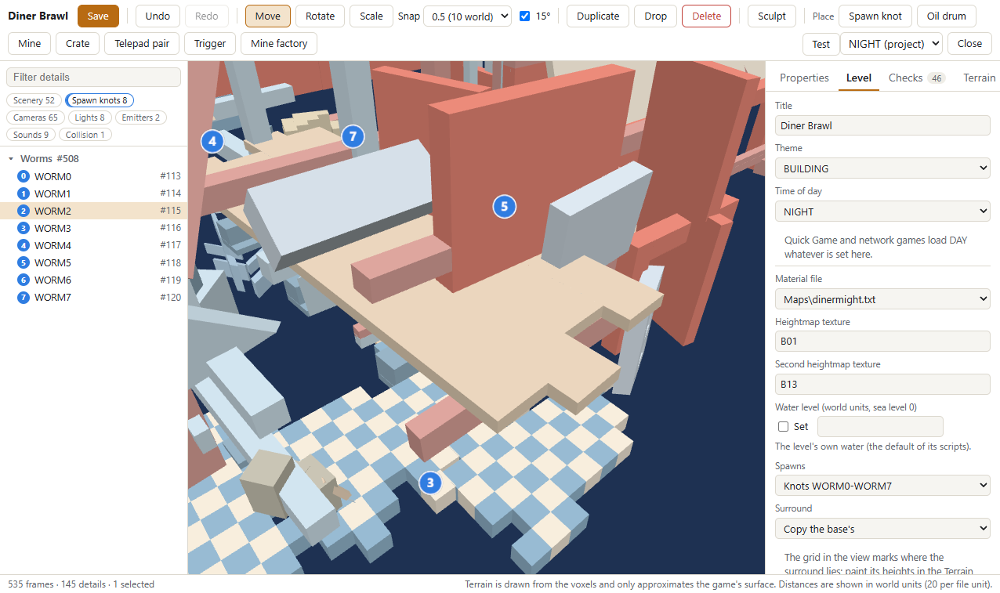
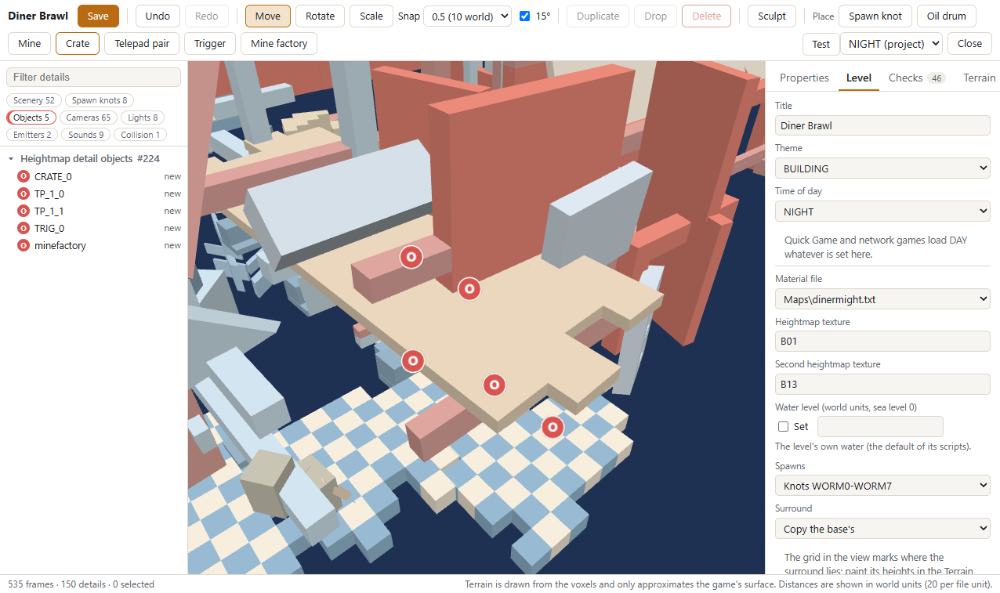
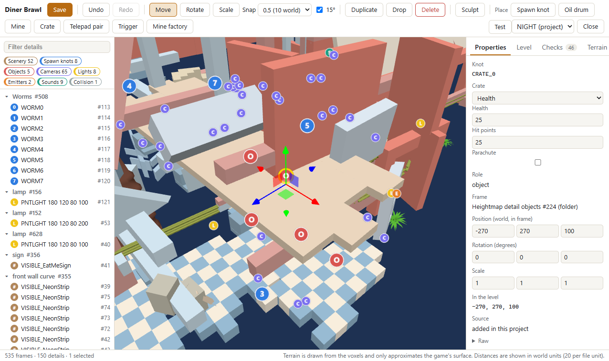
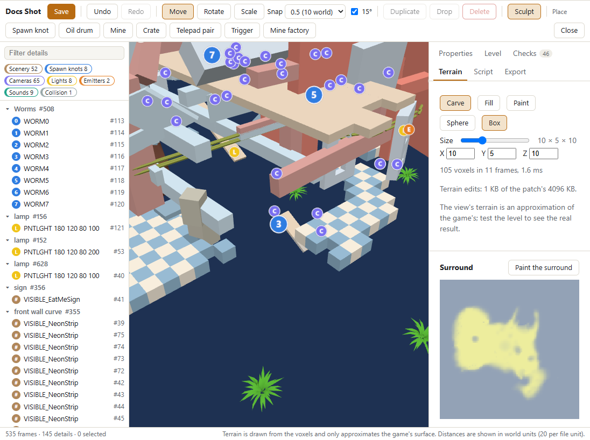
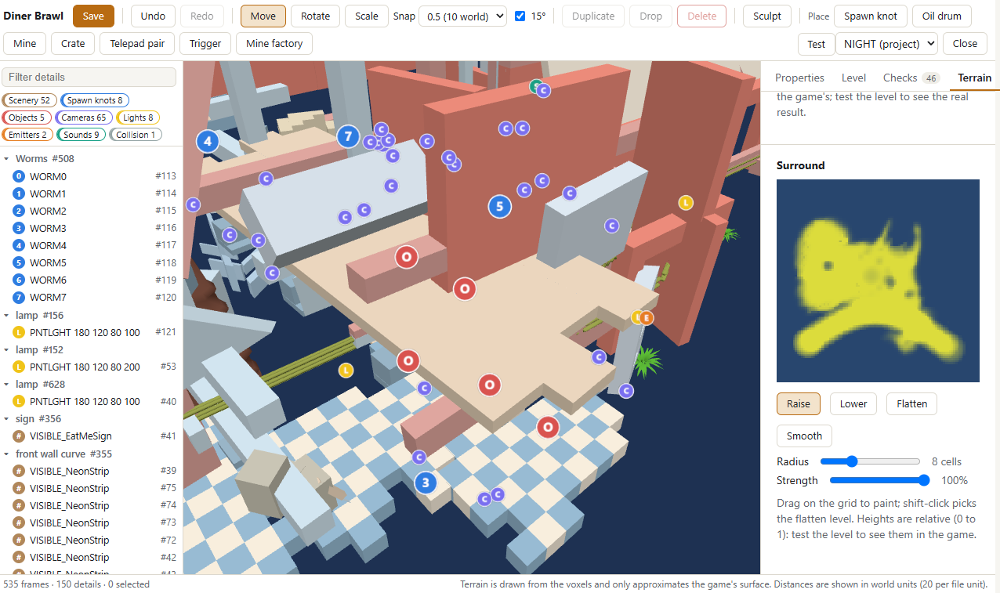
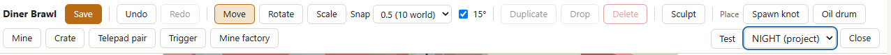
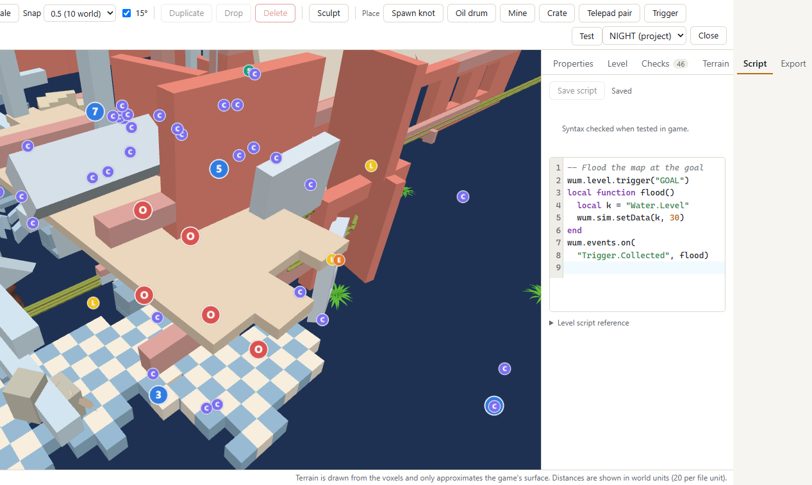

# Erg: the map editor

Erg is Oasis's level editor: it loads one of the game's own maps or a map you're already building, lets you move
spawns, place objects, sculpt the terrain and add blocks, paint the surround, add a level script, set water and theme,
and export the result as a mod. It never touches your game files directly — everything happens through the local
server (`melange.asi` with the game running, or `oasis.exe` with it closed), which is the only thing that reads `Data\`
and writes `Mods\`.

## Opening it

Open Oasis (see [oasis.md](oasis.md)) and pick the *Erg* panel, either with the game running or from `oasis.exe`
with it closed. Editing and building a pack work either way; **Test** needs the game running, at the main menu, and
not in a lobby.

## Projects

A project is one map you're editing: a base level plus your changes, saved under
`Documents\Melange\erg\projects\<id>\`. Opening the panel lists the game's own multiplayer maps and any project you
already started; pick one to start a new project from it, or an existing project to keep going. **Save** (Ctrl+S)
writes the project atomically; until then your edits and the undo history live in the page, and unsaved edits come
back as a draft if you reload it. Only one server (the game or `oasis.exe`, not both) can have a given project open at
a time. Map packs that ship only their patches (see Export) are listed at the top with a **Build** button.

## The view and tools

- **Camera:** orbit, pan and zoom with the mouse.
- **Selecting and moving:** click a spawn, object or scenery piece to select it; drag its gizmo to move, rotate or
  scale it, with snapping (1, 0.5 or 0.1 map units, and 15° steps).
- **Outliner and properties:** a tree of everything in the map on one side, and the selected thing's fields (name,
  position, rotation, scale) on the other.

- **Units:** the editor works in world units, which are 20× the numbers stored in the level file. A worm 1 map unit
  from a wall in the file is 20 world units away on screen — the same units the game's own camera and physics use.
- **Placing:** pick *Spawn knot*, *Oil drum*, *Mine*, *Crate*, *Telepad pair*, *Trigger* or *Mine factory* in the
  toolbar, then click the terrain. *Drop* (G) puts the
  selection on the ground below it; *Duplicate* (Ctrl+D) copies spawns and objects (not scenery).
- **Undo and redo:** Ctrl+Z and Ctrl+Shift+Z, up to 500 steps.
- The 3D view is an approximation of the game's own geometry, close enough to place things accurately but not a
  pixel-identical render of the game.

## Spawns

A map's spawn mode is either:

- **Random** (the default): worms land wherever the game's own random spawn logic puts them, same as an unedited
  map.
- **Knots:** place up to 8 numbered markers (`WORM0`..`WORM7`); worm *i* always starts on marker *i*. Every match
  needs all 8, even in smaller games — the map simply won't use the markers past the worm count.



## Objects

- **Oil drums** and **mines** are always placed, whatever the match's scheme.
- **Crates** hold a weapon, health or a utility; the Properties tab sets the contents, count or amount, hit points
  and parachute.
- **Telepad pairs** place two pads in one group: a worm on one pad comes out of the other.
- **Triggers** have an index, a radius and the teams that collect or destroy them; a
  [level script](#level-scripts) reacts to them.
- One **mine factory** per map. It replaces the scheme's own factory, so a match never has two.

Crates, telepads, triggers and the mine factory sit on knots the game reads when the match starts. Using any of them
saves the project as format v2 (see [Formats](#formats)).





## Water

Set a water level or leave it at the map's own default. The number is in world units, with sea level at 0; on Diner
Might, 150 floods nearly everything.

## Theme and time of day

Changing the theme swaps the terrain's material and texture set (for example, Camelot's stone-and-banner look) and
loads that theme's own height-map textures; it doesn't rewrite the terrain itself. Quick Game and network games load
every map in daytime, whatever the project's time of day says. To see the map at evening or night, pick that time
for **Test** (see [Testing your map](#testing-your-map)).

## Terrain

Press **Sculpt**, then drag over the terrain to carve, fill or paint with a box or sphere brush (the *Terrain* tab sets
the mode, shape, size and material; `[` and `]` resize the brush, and Alt-drag still orbits). Fill with *Match
column* takes the material of the terrain above. Fill and paint stay inside the piece of terrain the stroke started
on.

**Blocks.** *Add block* places a new solid block of the brush's size (1-32 voxels a side) and material: click the
terrain and the block rests there, its corner snapped to whole map units. A block can be sculpted like any other
terrain, and the *Terrain* tab lists the blocks with a *Remove* button. A map holds up to 64.

**Second material (experimental).** *2nd material* paints one of the level's materials (named from its material file)
over solid voxels; the voxels next to the brush take it on the corners they share, so it blends at the edge. *Remove*
restores what the map had. The corner mask also shapes collision slightly, so test the map.



## Surround

The *Surround* setting keeps the base map's far-off scenery ring (*copy*), removes it (*none*) or flattens it
(*flat*).

*Painted* lets you reshape it: the **Terrain** tab shows the surround as a 100×100 top-down grid, starting from the
base map's heights. Drag on it with *Raise*, *Lower*, *Flatten* (shift-click a cell to pick its height) or *Smooth*.
Heights run from 0 to 1 and are relative; test the map to see them in the game. A changed surround also rebuilds
the level's shadow cache, and a painted one saves the project as format v2.



## Testing your map

Press **Test** to play the map as it stands, without exporting or restarting anything:

1. Pick a time of day next to the Test button: *DAY*, *EVENING* or *NIGHT*. It starts at the project's own setting
   and applies to this Test only.
2. Erg builds your changes into a private, offline-only copy of the map (never your `Mods` folder).
3. It registers that copy for one session and arms a one-time override so the very next match loads it.
4. If your game build supports starting a match from the editor directly, Test starts Quick Game itself. Otherwise
   the status line asks you to press Quick Game yourself — the override is already armed, so that press loads your
   map.



A Test map never appears to anyone else and never starts in an online match; it's for checking your own work before
you export. Testing again after another edit simply overwrites the same private copy.

## Level scripts

The **Script** tab holds the map's own Lua, saved in the project as `script.lua`. It runs in the match's sandbox,
the same one a content mod's `entry.sim` gets (see *Sim scripts* in [developer-guide.md](developer-guide.md#sim-scripts)),
after every mod's sim script and only when this map is the one being played. **Save script** (Ctrl+S) checks the text
first and marks the line of any problem; Test saves it and runs the saved text, so an edit followed by another Test
needs no restart. Export ships it as `sim/<slug>.lua` and names it in the level's `levels[].sim` in `spice.json`.
`oasis.exe` checks only the script's size and encoding; the syntax is checked while the game is running.



```lua
wum.level.trigger("GOAL", { radius = 80 })
wum.events.on("Trigger.Collected", function()
  wum.sim.setData("Water.Level", 30)
end)
wum.events.on("sim.turnStarted", function(name, turn)
  if math.mod(turn, 5) == 0 and wum.level.knots["CRATE1"] then
    wum.level.crate("CRATE1", { kind = "health", amount = 50 })
  end
end)
```

| Name | Purpose |
|---|---|
| `wum.level.stem`, `wum.level.key` | This map's file stem and registry key (`Multi.<stem>`) |
| `wum.level.knots` | Read-only table of the map's named knots, name → kind (no positions) |
| `wum.level.trigger(knot [, opts])` | A trigger at a knot; `opts`: `index`, `radius`, `teamCollect`, `teamDestroy`, `hitpoints`, `wormCollect`. `true`, or `nil` and a reason |
| `wum.level.crate(knot [, opts])` | A crate at a knot; `opts`: `kind` (`weapon`, `health`, `utility`), `contents`, `count`, `amount`, `hitpoints`, `parachute` |
| `wum.events.on("sim.turnStarted", fn)` | `fn(name, turn)` at the first tick of each turn, on every machine at the same tick |

Everything else (`wum.events`, `wum.sim.*`, `wum.log`) is the sim script API. In logs and in Wormsign the script is
named `<mod id>:<slug>` (`erg:<project>` while testing).

**Sandbox limits.** No engine globals (`SendMessage` and friends are `nil`), only the messages the sim allows
(`GameLogic.PauseGame` and the like are refused), and an instruction budget per call (`[SimBridge] InstrPerCall`): a
callback that errors or runs out of budget three times is switched off, and the match goes on. A script is at most
256 KB of UTF-8 text with no byte order mark; compiled Lua is refused.

**Determinism.** Every machine in a match runs the script and must reach the same result, so:

- use `wum.sim.random` (`math.random` is the same stream), never the clock or anything local to one machine;
- numbers are floats (exact integers only up to 2^24), and it's Lua 5.0: `table.getn(t)` not `#t`, `math.mod` not `%`;
- a closure inside a loop sees the loop variable's last value, so copy it into a `local` first;
- keep state in globals or `wum.sim.storage` (Wormsign hashes those) or pass it to `wum.sim.hash`.

Online, everyone must have the same pack version, which covers the script's bytes, and a replay refuses to play if
the level script has changed since it was recorded.

## Export

Exporting turns a project into a mod under `Mods\`, in one of two forms:

- **Source** (recommended for sharing): just your edits — a small JSON file plus a build script. Whoever receives it
  runs the build script against their own copy of the game to produce the actual map files. Nothing of the game
  itself travels in this form, so it's the right way to share a map with someone else.
- **Install** (for your own machine only): the full, ready-to-play map files, generated from your edits against your
  own install. This form contains modified copies of game files and should stay on your computer — don't redistribute
  it.

Either way you give the export a mod id, a display name and a version; exporting into a mod id you've already used
adds the new map alongside any others already in it (or updates it, if you export the same map again). Whether it
needs a restart is covered under [Live packs](#live-packs); the dialog tells you.

If you choose Source, the recipient enables the mod and either presses *Build* in Erg or runs its `build.ps1`, which
needs nothing but their own game install; either produces byte-identical files to what Install would have written
on your machine.

## Playing an exported map

An exported map appears under *Prebuilt* in Versus, exactly like one of the game's own maps, once the mod that ships
it is enabled.

### Survivor copies

The export dialog's *Survivor copy* box (on by default) also lists the map in Survivor: Local Game, Versus,
Survivor, *Landscape*, then the *Prebuilt* section, under the same title. The copy uses the same files, spawns,
objects, water and level script as the map itself, and runs the game's Survivor rules on top. It is always unlocked,
whatever the base map's lock is in your save. In `spice.json` it is the level's `"survivor": true`.

- Maps are registered at the main menu, before any Survivor screen is opened. A pack enabled or disabled at the menu
  ([Live packs](#live-packs)) shows up or disappears in Survivor once you leave the screen and open it again.
- Online, a Survivor copy follows its map's rules below: everyone needs the same version of the mod.
- `[Levels] RandomPool=0` (the default) keeps both the map and its copy out of the game's random picks, Survivor's
  included.
- The game remembers the last Survivor map you picked. When that map's mod is no longer enabled, Melange puts a
  vanilla Survivor map back in its place at the main menu, so a lobby never starts on a map that isn't there.

### Live packs

A pack of maps can be enabled or disabled on the Mods page without a restart when:

- the game is at the main menu, offline, not in a lobby, and no Test is running;
- the pack holds only maps. A pack with level scripts or `entry.sim`, weapons, messages, client code or file overrides
  needs a restart.

A map enabled this way plays offline only until the next restart; online, a start on it is held with a banner. Set
`[Levels] LivePacks=0` to turn live packs off.

**Online rules:** a map you made plays online only when everyone in the lobby has the exact same version of the mod
that ships it — Melange checks this automatically. If anyone doesn't match, the host's selection of that map is held
with a banner naming who's missing it, and maps you've only Tested never start online at all. A vanilla player simply
can't pick your map to begin with.

## Formats

A project or Source export is saved as `erg-patch/1` unless it uses level objects, a level script, added blocks or a
painted surround; then it is saved as `erg-patch/2` (and its scene as `erg-scene/2`). This Melange reads both: a v1
project opens and saves as before, and becomes v2 only once you use one of those features. There is nothing to migrate
by hand. An older Melange that knows only v1 refuses a v2 project or pack by its format, so players need this version
or later to build or play a v2 map; a painted second material needs it too. The schemas are
[erg-patch-2.schema.json](erg-patch-2.schema.json) and [erg-scene-2.schema.json](erg-scene-2.schema.json).

A map with spawns, objects or water exported or built by this Melange needs this Melange or later: its generated chunk
now does its set-up when the match starts (the form Survivor needs), and an earlier Melange refuses that chunk and a
Survivor copy. Packs exported by an earlier Melange keep working unchanged.

## Limits

- Up to 32 maps in one mod, 128 across every enabled mod at once.
- A map title is 1-40 plain-ASCII characters.
- Up to 64 added blocks per map, each side 1-32 voxels.
- A patch (your saved edits) is capped at 20 000 operations and 4 MB — enough for any hand-made edit; if you hit
  this, split the changes into more than one exported map.
- Not yet supported:
  - per-team or story spawn points, and story or challenge map types;
  - editing the map's generated chunk (Erg rewrites it every export; use a [level script](#level-scripts));
  - checking a level script's syntax outside the game: `oasis.exe` checks size and encoding only;
  - enabling a pack with level scripts without a restart (see [Live packs](#live-packs)).
- A replay recorded on a Test map only plays back correctly while your Test workspace still has the same files —
  moving on to a different edit, or exporting for real, can make an older Test recording unplayable.

## Troubleshooting

- **A map you enabled doesn't show up:** it needs a restart after being enabled, like any content mod; check the
  Mods page for "restart required".
- **"Not built"** on a Source-form mod: press *Build* in Erg, or run the mod's `build.ps1`, then restart.
- **Test is greyed out or missing:** the game needs to be running, sitting at the main menu, and not in a lobby;
  `oasis.exe` has no Test.
- **A map is missing online, or a teammate's start is held:** everyone needs the exact same version of the mod; check
  who's missing it in the lobby panel.
- **Something looks wrong in the 3D view but fine in-game (or the reverse):** the editor's view is an approximation;
  trust Test (which runs the real game) over the preview for anything that matters.
- For anything else, the game's log has an `[erg]`/`levels` line naming what happened at each step (registration,
  test starts, exports) — attach it if you report a problem (see the main [README](../README.md#reporting-a-bug)).
