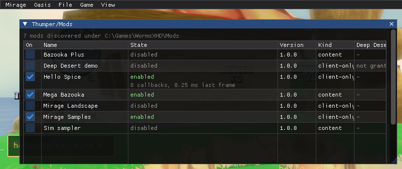
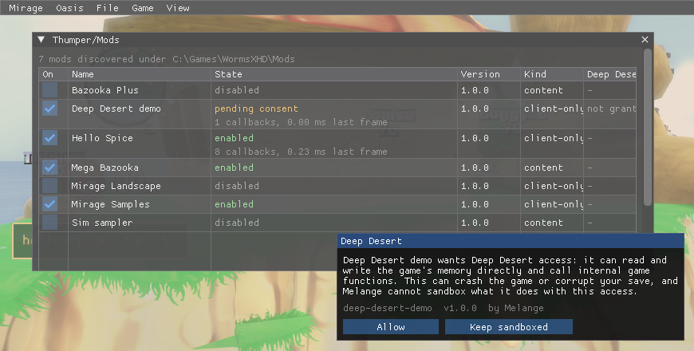

# The Spice manifest (`spice.json`)

A Thumper mod is a folder under `<game>\Mods\<id>\` with a `spice.json` at its root. The machine-readable
schema is [spice-1.schema.json](spice-1.schema.json); this page explains the fields and how Thumper uses
them. A folder with no `spice.json` still loads as an implicit, client-only, dependency-free mod named
after its folder — every M1-era `Mods\` folder keeps working unchanged.

## Minimal example

```json
{
  "spiceVersion": 1,
  "id": "hello-spice",
  "version": "1.0.0",
  "name": "Hello Spice",
  "melange": { "range": ">=0.3.0 <0.4.0" },
  "kind": "client-only",
  "entry": { "client": "client/init.lua" }
}
```

## Fields

| Field | Notes |
|---|---|
| `spiceVersion` | Must be `1`. A manifest with a schema version Thumper doesn't know is `incompatible` and never gets a load-order slot. |
| `id` | Lowercase, `[a-z0-9_-]`, 1-64 characters. **Must equal the folder name** — one id, one folder. Used as the dependency-graph key and the `wum.storage`/`wum.config` namespace. |
| `version` | Semver `MAJOR.MINOR.PATCH[-prerelease][+build]`. |
| `name`, `authors`, `description`, `website` | Display only. |
| `melange.range` | An npm/Cargo-style semver range (`^1.2.0`, `>=0.5.0 <0.7.0`, space = AND) the running Melange version must satisfy, or the mod is `incompatible` (and the [compatibility sweep](#compatibility-sweep) moves it out of `Mods\`). |
| `kind` | `client-only` (never touches the simulation, the wire, or `Data/Tweak/*`; no online handshake) or `content` (does at least one of those). `entry.sim`, `messages`, or `permissions.unsafe: true` all imply the mod counts as content for the online handshake even if `kind` says otherwise. |
| `dependencies`, `optional`, `conflicts` | Arrays of `"<id>"` or `"<id> <comparator><version>"` (e.g. `"weapon-toolkit >= 2.0.0 <3.0.0"`). `dependencies` are required and order the graph; `optional` orders the graph only when the id is present and version-compatible; `conflicts` blocks both mods, whichever side declares it. |
| `loadAfter` | Plain mod ids: an ordering-only edge with no existence requirement — nothing breaks if the named mod isn't installed. |
| `permissions.unsafe` | Deep Desert: `wum.unsafe.*` (raw memory read/write, calling game functions), client VM only. Enabling such a mod opens a consent modal in the overlay; declining still loads the mod, with `wum.unsafe` calls raising instead of working. |
| `permissions.filesystem` | `none` (default), `own-folder` (read) or `own-folder-write`, for Melange-mediated file helpers. Never raw Lua `io`. |
| `permissions.network` | Reserved for a later milestone. Accepted and ignored (with a log warning) by this build. |
| `entry.client` | Path, relative to the mod folder, loaded into the always-on Sandbox VM (Lua 5.4). |
| `entry.sim` | Path registered into the match's Lua VM at match start (Lua 5.0 dialect, float numbers). Requires `kind: "content"`. |
| `assets.root` / `.shaders` / `.effects` | Data-override folders, as M1's `Mods\<id>\` already used (defaults `assets`, `shaders`, `effects`). |
| `contentHash.include` | Glob list of files that feed the online content hash (default: `entry.sim`, `assets/**`, `*.spice.json`). Never computed for a client-only mod. |
| `messages` | Up to 16 engine message names this content mod registers (pattern `Prefix.Sub[.Sub...]`, 1-5 dotted segments after the first capitalised word). Checked against the **live** vanilla message registry at start-up, not a fixed list in the schema — a name that collides with a vanilla one is skipped and logged, not a hard error for the rest of the mod. The engine has 73 free slots; Thumper caps registrations at `[Thumper] MaxModMessages` (48) across every mod combined. |
| `settings` | `{key, type: bool\|int\|float\|string\|enum, default, min?, max?, options?, label}`. Drives `wum.config.get/set` and the per-mod widgets on the Mods page. |
| `weapons` | Weapon clones, `kind: "content"` mods only — see below and [weapons.md](weapons.md). |
| `schemes`, `factoryWeapons` | Game styles and custom-weapon presets from data files, allowed for client-only mods; see [`schemes` and `factoryWeapons`](#schemes-and-factoryweapons-game-styles-and-weapon-presets). |
| `music` | MP3 tracks for the sudden-death music, allowed for client-only mods; see [`music`](#music-sudden-death-music). |
| `defaultEnabled` | Honoured only the first time Thumper ever sees this mod id (default `true`). The shipped samples set it to `false`. |

| Before: `unsafe` mod switched on | After: the consent modal |
|---|---|
|  |  |

## `weapons`: weapon clones

A `kind: "content"` mod can declare up to 3 weapon clones (schema: [spice-1.schema.json](spice-1.schema.json)),
in the free panel cells 29, 39 and 40 — shared across every enabled mod, not per mod. This is checked in two
passes, both at every Thumper rescan:

1. **Shape**, right here in `spice.cpp`: at most 3 entries, each an object with a known set of keys
   (`name`, `base`, `cell`, `bank`, `set`, `panelIcon`, `hudIcon`, `text`), `set` values that are a number, a
   boolean or a string. A shape error refuses the whole mod, naming the bad key or value.
2. **Names, bases, cells and field types**, in `weapons/manifest.cpp` — the base whitelist, the resource-name
   pattern, cell conflicts between mods (later load order loses), and each `set` field checked against the
   base's own container schema. A mod that fails here is `Incompatible` with the specific reason.

The full field reference, the base whitelist, the Lua side (`wum.sim.weapons`) and what does and doesn't work
yet are in [weapons.md](weapons.md); `dist\Mods\mega-bazooka` is a complete, working (disabled) example.

## `levels`: map packs

A `kind: "content"` mod can ship maps built with [Erg](erg.md), up to 32 per mod and 128 across every enabled mod:

```json
"levels": [{ "slug": "harbour", "title": "Harbour Brawl", "type": "multi", "chunk": true, "source": "src/harbour.ergpatch.json" }]
```

| Field | Notes |
|---|---|
| `slug` | `[a-z0-9]{1,24}`, unique within the mod. The level's file stem is `<prefix>_<slug>`, where `<prefix>` is the mod id with `-` turned into `_`. |
| `title` | Printable ASCII, 1-40 characters. What players see in the Prebuilt list. |
| `type` | `multi` only — other map types aren't supported yet. |
| `chunk` | `true` when the pack ships a generated script (`assets/levels/<stem>.lub`) for spawns, placed objects or a water level. |
| `source` | Path to the patch the map was built from (Erg writes this). When the built files are missing, the mod is `Incompatible` with "not built: open Erg and press Build, or run build.ps1". |
| `sim` | Optional `sim/<name>.lua`: the map's [level script](erg.md#level-scripts), run in the sim sandbox only on this map. At most 256 KB of UTF-8 without a byte order mark. |
| `survivor` | Optional, default `false`: also list the map in Survivor's *Prebuilt* section as `Multi.<stem>.S`, on the same files (see [Survivor copies](erg.md#survivor-copies)). Earlier Melange versions refuse it. |

Two mods that resolve to the same prefix (their ids differ only by `-`/`_`) can't both ship maps; the later one in
load order is `Incompatible`. A map's own files never touch anything under `Data\`, are never named the same as one
of the game's own map files, and never include the shadow-cache files (`.csh`) the game itself generates.

## `schemes` and `factoryWeapons`: game styles and weapon presets

Data only, so both are allowed for a `kind: "client-only"` mod (a content mod may use them too). Each is an array of
`{ "file": "<path>.json" }`; the path is relative to the mod folder, must stay inside it and end in `.json`.

```json
"schemes": [{ "file": "schemes/kanly.json" }],
"factoryWeapons": [{ "file": "weapons/red.json" }]
```

At most 8 schemes and 16 factory weapons per mod, and 32 and 64 across every enabled mod. A key used twice (by any
mod, or by one of the game's own entries) is refused with an error in the log (`[schemes] <mod>/<file>: ...`) and that
entry is skipped; the rest of the mod still loads. A shape error in the manifest itself refuses the whole mod, as
for `levels`.

**Scheme file**: one game style, listed in *Versus > Deathmatch > Game Style* (and the same list in the other local
modes) as a permanent built-in style: the game neither edits nor deletes it, and the list is sorted alphabetically by
display text. The scheme is a copy of a built-in one with your changes.

```json
{
  "key": "FETXT.Scheme.Kanly",
  "title": "Kanly",
  "base": "FE.Scheme.Standard",
  "lock": "Lock.Scheme.Standard",
  "fields": { "RoundTime": 300000, "SuddenDeath": 1, "WaterSpeed": 3 },
  "weapons": {
    "*": { "Ammo": 10, "Delay": 0 },
    "ConcreteDonkey": { "Ammo": 1 },
    "HealthMystery": { "Crate": 50 }
  }
}
```

| Field | Notes |
|---|---|
| `key` | `FETXT.Scheme.<Name>`, the name being 2-32 letters or digits starting with a letter. It is the scheme's `Name` and the name of its display string. |
| `title` | The text shown in the list, 1-24 printable ASCII characters. |
| `base` | The `Name` key of a built-in scheme to copy (default `FE.Scheme.Standard`; others include `FE.Scheme.Pro`, `FE.Scheme.Beginner`, `FETXT.Scheme.Darksider`). |
| `lock` | Optional lock key (default: the base's, `Lock.Scheme.Standard` for Standard, which is unlocked from the start). `Lock.AllwaysLocked` hides the scheme. |
| `fields` | Any integer or boolean field of the game's `SchemeData` by name, e.g. `Wins`, `WormHealth`, `RoundTime` and `TurnTime` (milliseconds), `SuddenDeath` (0 is 1 Health, 1 is Raise Water, 2 is Draw Round), `WaterSpeed` (1 Slow, 2 Medium, 3 Fast), `WindMaxStrength`, `MineFactoryOn`. Integers must fit in int32. `Permanent` is always `true`. |
| `weapons` | Per-weapon `Ammo`, `Crate` and `Delay`, keyed by the `SchemeData` field name of the weapon (`Bazooka`, `ConcreteDonkey`, ..., and the 15 `...Mystery` entries). `"*"` applies to all 58 entries first, then each named entry on top. |

An unknown field or weapon name, a value that is not an integer or is outside int32, or an unknown key is an error
and the scheme is skipped.

**Factory weapon file**: one custom-weapon preset, listed in the team editor's weapon list. A team stores only the
preset's key.

```json
{
  "key": "FETXT.Kanly.Red",
  "title": "Red Kanly",
  "base": "FETXT.WipeOut",
  "stock": true,
  "weapon": { "WormDamageMagnitude": 1.2, "FuseTime": 1500, "DetonationFX": "WXP_ExplosionX_Med" },
  "cluster": { "WormDamageMagnitude": 0.6 }
}
```

| Field | Notes |
|---|---|
| `key` | `FETXT.<Name>[.<Name>...]`, 6-40 characters, each part letters and digits starting with a letter; not a built-in key. The preset's `Weapon` container's `Name` is set to it, and it is the display string's name. |
| `title` | The text shown, 1-24 printable ASCII characters. |
| `base` | Required: the key of a built-in preset to copy (weapon and cluster): `FETXT.AFewProblems`, `FETXT.ChatterBomb`, `FETXT.KneeTrembler`, `FETXT.ThePeaceBreaker`, `FETXT.TheBrownSofa`, `FETXT.Factory.Blaster` or `FETXT.WipeOut`. |
| `stock` | `StockWeapon`, default `true`. |
| `weapon`, `cluster` | Overrides on the two `WeaponFactoryContainer`s by field name: booleans, integers (int32; `U32` fields 0 to 4294967295), enums as integers (0-255), floats, strings (printable ASCII) and the string arrays `GraphicalResourceID` and `GraphicalLocatorID`. `Name` cannot be overridden. |

Melange rebuilds the game's `DATA.LockedSchemes` and `DATA.LockedWeapons` resources from its own `Data\Tweak\LOCAL.XOM`
with the entries of every enabled mod appended, writes them to `Melange\cache\schemes\`, and loads them over the
originals at the frontend (again whenever the set of enabled mods changes while you are at the menus; a disabled
mod's entries leave the lists without a restart, expected but not yet verified in game). With no enabled mod declaring either key, nothing is touched.
`[Schemes] Enabled=0` in `Melange.ini` turns it off.

Both lists are client-side. A host's scheme and a team's preset key travel to peers by the vanilla protocol, so peers
need nothing installed; a peer without the mod may see the raw `FETXT.Scheme.<Name>` key as the style's name in the
lobby (unverified). That a preset is listed in the team editor is expected to work like the scheme list but has not
been verified in game.

## `music`: sudden-death music

Replaces the music that plays when sudden death starts with MP3s from the mod. Allowed for a `kind: "client-only"`
mod (a content mod may use it too): the music is local, and every player hears their own.

```json
"music": [
  { "slot": "suddenDeath", "file": "music/ash-ridge.mp3", "title": "Ash Ridge", "credit": "Slaughter at Ash Ridge" }
]
```

| Key | Meaning |
|---|---|
| `slot` | Required. Only `"suddenDeath"` for now; another value refuses the mod. |
| `file` | Required. A `.mp3` path relative to the mod folder, inside it, at most 24 MiB. |
| `title` | Required. 1-48 printable ASCII characters, shown in the log. |
| `credit` | Optional, at most 96 characters: the original title or author, shown in the log only. |

At most 16 entries per mod and 64 tracks per slot across every enabled mod. The audio must be MPEG-1 or MPEG-2 Layer II
or III (a normal MP3; ID3 tags are skipped), with at least 50 frames, and one sample rate and channel count throughout
the file. All tracks of a slot must share one sample rate and channel count (Melange does not resample): the first
track in load order sets them and a track that differs is skipped with an error in the log (`[music] <mod>/<file>: ...`).
A shape error in the manifest itself refuses the whole mod. Only add music you hold the rights to; Melange does not
check, and the plugin author is responsible for what a plugin ships.

Every enabled mod's tracks for the slot are played back to back in a random order, with hard cuts. The order is new for
every match, and the track that led last time does not lead again when there are two or more tracks. With no enabled
mod declaring music the game's own music plays. The game's own `muSuddenDeath.fsb` is never modified, and the
sudden-death sting and commentary are untouched. `[Music] Enabled=0` in `Melange.ini` turns it off.

## Resolution

Thumper resolves the whole `Mods\` folder as one pass, deterministically:

1. **Parse and validate** every folder. A manifest that fails the schema, has an unknown `spiceVersion`,
   or whose `melange.range` excludes the running build is `incompatible` and excluded from the graph
   entirely. Normally such a mod has already left `Mods\` (see [Compatibility sweep](#compatibility-sweep)).
2. **Build edges** from `dependencies` (required), `optional` (soft, only when present and compatible)
   and `loadAfter` (ordering only).
3. **Topologically sort**, ties broken **by id, ascending** — the same mod set always resolves to the
   same order, regardless of folder creation order or scan order.
4. **Conflicts and consent.** A `conflicts` pair blocks both sides. A required dependency on a blocked
   mod blocks the dependant too ("blocked because X is blocked"). A cycle blocks every mod in it with
   one shared reason. An `unsafe` mod without a Deep Desert grant is `pending-consent`, not blocked — it
   still loads, with `wum.unsafe` raising until the user answers the prompt.

**Content-mod changes need a restart.** Message names are registered once per launch and never
unregistered, so enabling or disabling a `content`-relevant mod takes effect at the next launch (shown as
`restart-required` on the Mods page in the meantime). Client-only mods toggle live.

## State

Choices persist in `Mods\thumper-state.json` (falling back to `Documents\Melange\thumper-state.json` if
the game folder is read-only): which mods are enabled, load-order pins, Deep Desert grants, and whether the
Mods pages show local plugins (`showLocal`, shared by the game and Melange.exe). It is
written atomically and is safe to delete — Thumper rebuilds it (re-applying `defaultEnabled` for every
mod as if freshly discovered).

A mod that keeps files of its own inside its folder should keep them in `Mods\<id>\user\`: the Store carries that
folder over when it updates the mod, and a plugin's release zip may not contain it. Folders starting with `.` are
never mods (the Store keeps its own files in `Mods\.store\`, the compatibility sweep in `Mods\.incompatible\`).

## Compatibility sweep

A mod this Melange can never load doesn't stay in `Mods\`. When the game starts (before Thumper's first scan, so no
file in a mod folder is open yet) and when Melange.exe opens a game folder that the game isn't running from, every
folder is checked: a `spice.json` that does not parse (including an unknown `spiceVersion`), a malformed
`melange.range`, or one the running version does not satisfy. A missing dependency, a conflict or a pending consent
are not reasons: the user can fix those. A folder without `spice.json` is never touched.

- **Store plugins** (a record in `Mods\.store\installed.json`) are updated to the newest version the Store's list
  has for this Melange and game build, or removed when a list fetched just now has none (keeping the map packs an
  importer made, and `[Mod.<id>]` settings and saved data). Melange.exe fetches the list for this, and only when
  such a plugin exists; the game uses the list it cached and never downloads, so there such a plugin only stays
  unloaded until Melange.exe updates or removes it. Offline, Melange.exe does the same: a cached list may predate
  the plugin release that supports a new Melange, so it is never reason enough to remove one. A Store plugin the list says is not built for this
  game build counts too.
- **Local plugins** move to `Mods\.incompatible\<folder>\` (`<folder>-2`, `-3`, ... when that exists; nothing is
  overwritten), with a `.melange-quarantine.json` beside its files saying why, against which version and when.
  Their `thumper-state.json` entries go. Move the folder back to try it again (it is moved out again while it still
  cannot load).

Each action is logged and leaves a notice in `Mods\.incompatible\notices.json` (the newest 50) that the Plugins page,
the *Thumper/Mods* page and the Oasis Mods panel show until it is dismissed. `[Thumper] SweepIncompatible=0` turns
the sweep off (in the game and in Melange.exe): such mods then just show as `incompatible` and never load. While you
work on a mod of your own, a typo in its `spice.json` moves it too: set the key to `0` for that.
