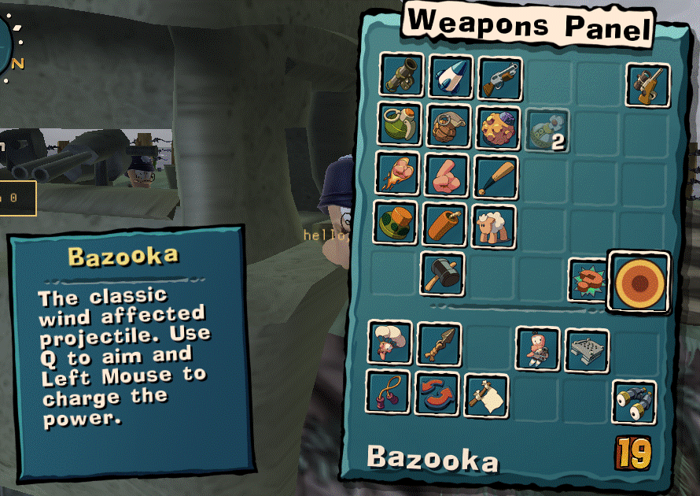
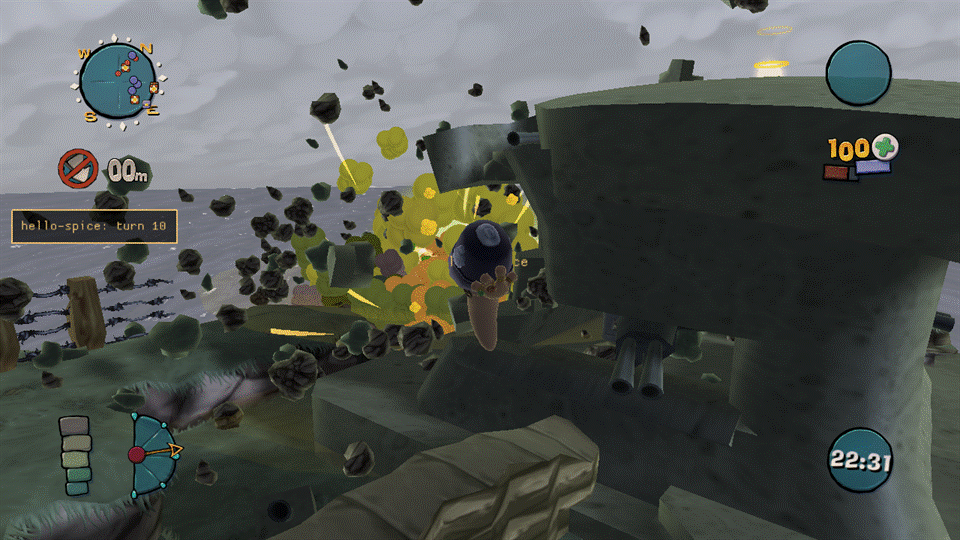
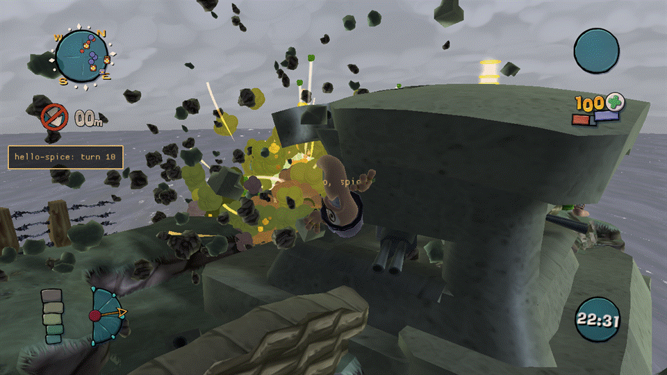

# Weapon mods

A **weapon clone** is a new weapon that reuses one of a small set of vanilla weapons' code, with its own name,
icon, stats and Lua behaviour. `dist\Mods\mega-bazooka` (shipped disabled) is a complete, working example; this
page is the field-by-field reference. It assumes you've already read [spice.md](spice.md) for the rest of a
mod's manifest.

## How a clone works

A clone is not a new weapon class — it's the *same* code as one of a handful of vanilla weapons (the
**base**), given its own name, its own stats and its own panel cell. Concretely:

- Only the free panel cells take a clone: **29, 39 and 40**. A match has at most 3 clones in total, across
  every enabled mod.
- Firing, flight, impact and the explosion all run the base's own code — a Bazooka clone flies and explodes
  exactly like a Bazooka. What's different is a handful of container fields (`set` in the manifest) and, while
  the clone is selected, the worm's weapon name.
- **Ammo, delay, AI use, crates and the scheme all follow the base.** A clone can't have its own ammo count or
  its own delay in this version (that's planned for a later milestone); if the base is in the scheme, so is
  every clone of it, with the base's ammo and delay. Achievements and stats count a clone as its base.
- A clone exists only inside a match that allows sim mods (an offline game, or an online match where every
  peer has the same content). Outside such a match nothing is changed: no cell, no name, no hook.

## The `weapons` array

Add a `weapons` array to `spice.json` (schema: [spice-1.schema.json](spice-1.schema.json)). It's only allowed
in a `kind: "content"` mod, and it's capped at 3 entries **in total across every enabled mod** — the first mods
in load order get the free cells; a mod that doesn't fit is refused with the reason on the Mods page.

```json
"weapons": [{
  "name": "kWeaponMegaBazooka",
  "base": "kWeaponBazooka",
  "cell": 29,
  "set": { "WormDamageMagnitude": 120, "WormDamageRadius": 123.75, "LandDamageRadius": 90,
           "ImpulseRadius": 165, "PayloadGraphicsResourceID": "Grenade.Payload", "Scale": 10,
           "LaunchSfx": "weapons/SheepBaa" },
  "panelIcon": "icons/megabazooka.png",
  "hudIcon": "mega-bazooka.hud.tga",
  "text": { "name": "Mega Bazooka", "help": "Like a bazooka, only more so." }
}]
```







| Field | Rules |
|---|---|
| `name` | A new resource name: `kWeapon` + a capital letter + 2-40 letters/digits (`^kWeapon[A-Z][A-Za-z0-9]{2,40}$`). Can't be a vanilla name, and can't start with `kWeaponCluster` or `kWeaponFactory`. Must be unique across every enabled mod. |
| `base` | One of the whitelisted bases below. Anything else is refused at parse time with "not clonable in this version". |
| `cell` | `29`, `39` or `40`. Optional — left out, the clone takes the first free cell in load order. Two mods asking for the same cell: the later one in load order is refused. |
| `bank` | Optional: an `xomtool`-built `.xom` under `assets/data/` holding a container named `name`, of the base's class, taken instead of a plain copy of the base (`set` still applies on top). Build one with `xomtool bank` ([xomtool.md](xomtool.md)). A bank carries weapon properties only, not meshes — meshes come from the [`meshes`](spice.md#meshes-custom-3d-models) field, see "Meshes and sounds" below. |
| `set` | Container field name → value, typed against the base's own schema (`xom_schema.inc`): a number for an `F32`/integer field, `true`/`false` for a `Bool` field, a string for a `String` field. An unknown field name or a value of the wrong type refuses the mod at parse time, naming the field. |
| `panelIcon` | A path under `assets/`: a PNG, 64×64 (or a multiple, box-filtered down), RGBA. |
| `hudIcon` | A file name under `assets/loose/`, a `.tga`, named `<your mod id>.*` (never a bare vanilla-looking name — see "Icons and loose files"). |
| `text` | `{ "name", "help" }` for the panel. Used when the game build supports it (this build does — see "Panel name" below); ignored otherwise, logged once. |

## Bases

Only these five are clonable in this version. Each one is on the "ordinary" code path that doesn't special-case
its own container name, which is what makes cloning it safe:

| Base | Notes |
|---|---|
| `kWeaponBazooka` | The reference base; every check below was run against it directly. |
| `kWeaponGrenade` | |
| `kWeaponHolyHandGrenade` | |
| `kWeaponBananaBomb` | Bomblets spawn as the (unrenamed) vanilla `Bananette`. |
| `kWeaponGasCanister` | Its explosion does no direct damage, so a damage multiplier has no visible effect; poison from a clone isn't distinguished from poison from the vanilla canister. |

Weapons that pick their behaviour from their own name (Sheep, Homing Missile, Poison Arrow, guns, melee, and
utility items), and cell takeover beyond 29/39/40, are not in this version.

## Lua: `wum.sim.weapons`

This is a sim-script API (`entry.sim`, Lua 5.0 with float numbers — see the developer guide's
["Sim scripts"](developer-guide.md#sim-scripts) section for the base rules). It isn't part of
[lua-api.md](lua-api.md), which covers only the always-on client Sandbox; the sim match VM's weapon surface is
documented here instead.

| Function | Notes |
|---|---|
| `wum.sim.weapons.list()` | An array of `{name, base, cell, k, live}` for every declared clone. |
| `wum.sim.weapons.on(event, name, fn)` | `event` is `"fire"`, `"tick"`, `"impact"` or `"explosion"`; `name` is a clone's `name` or `"*"` for every clone. Returns a handle for `off`. |
| `wum.sim.weapons.off(handle)` | Removes a subscription. |
| `wum.sim.weapons.explode(dx, dy, dz)` | **Inside an `explosion` handler only:** one more explosion at the original position + `(dx, dy, dz)`, run after the original, in the same tick. Returns `true`, or `nil, reason` — `"not in explosion"` outside a handler, `"full"` past `[Weapons] ExtraPerExplosion` (default 8) extras from one explosion, `"range"` if any axis is over 2000 units. Extras raise no further events (no recursion). |
| `wum.sim.weapons.active()` | The clone name the active worm currently holds, or `nil`. |

`fn(event, name, tick, ...)` gets the event name, the clone name, the sim tick, and then:

- **`fire`**: nothing further.
- **`tick`**: **no position in this build.** A future build may add `x, y, z` once the engine's live payload
  position is found (see "What doesn't work yet"); until then, only rely on `event`, `name` and `tick`.
- **`impact`**: the `Payload.*` message name (`Payload.CollideWithLand`, `Payload.CollideWithWater`,
  `Payload.DisarmPlane`, `Payload.ExpiryPlane`, ...).
- **`explosion`**: `x, y, z`, the explosion's position. Call `wum.sim.weapons.explode` from inside this handler
  only.

There's no `damage` event in this version (a clone's damage isn't reliably attributable — see below), and no
`spawn` or `detonate` event.

**Determinism.** Every event fires at the same logic tick on every peer, with no randomness added and no
message posted by Melange itself — a handler is exactly as deterministic as any other sim-script code. Keep
handlers side-effect-light: they run under the same per-call instruction budget as any other sim callback
(`[SimBridge] InstrPerCall`), and a handler that faults three times is disabled for the rest of the match.

To read or change a clone's own fields during the match's `Init` (once, before the first turn), use the
existing `wum.sim.weapon(name):get(field)` / `:set(field, value)` from the README's Sim scripts table, by the
clone's `name`. `set` takes f32, i32, u32, u16, u8, bool and string fields (so counts such as `NumBomblets` and
delays such as `LaunchDelay` can be changed); a u16 field takes 0 to 65535 and a u32 field 0 to 16777216, because
the sim's Lua numbers are float32 and can't name every larger integer, so a u32 above that is refused (Lua itself
already rounds a literal 16777217 to 16777216, which is accepted; `get` of a u32 above 2^24 returns the nearest
float32). Setting u32 and u16 fields is covered by the offline self-test but hasn't been confirmed in a running match.

## Icons and loose files

- **Panel icon** (`panelIcon`): decoded once at start-up and written into a free slot of the weapon panel's own
  icon sheet the next time it's built. It shows in the weapon panel automatically; nothing else to do.
- **HUD icon** (`hudIcon`): a loose `.tga` under `assets/loose/`. It must be named `<your mod id>.<anything>` —
  `mega-bazooka.hud.tga` for this mod — never a bare name that could shadow a vanilla file. Shown on the HUD
  while the clone is selected.
- Both are presentation only: they never affect the simulation, and a mismatched or missing icon file is
  refused at load with a reason, not a crash.

## Meshes and sounds

- **`PayloadGraphicsResourceID`** (and `Payload2ndGraphicsResourceID`) can name **any vanilla payload mesh
  already used in the match** — this is confirmed working (the sample points its shell at `Grenade.Payload`,
  scaled up with `Scale`).
- **A mod-supplied mesh** comes from the manifest's [`meshes`](spice.md#meshes-custom-3d-models) field (not from
  `bank`, which carries weapon properties only): list a mesh bank built with `xomtool convert --bundle`, whose
  resource names all start with `<modId>.`, and the game loads it at the main menu. A clone's `set` or
  `wum.sim.weapon(name):set(...)` can then name the mesh in a `*GraphicsResourceID` field:
  `wum.sim.weapon("kWeaponBaseballBat"):set("WeaponGraphicsResourceID", "kindjal.NailBat")` made the worm hold the
  mod's baseball bat in a game test. What is **not** yet tried: a mod mesh in `PayloadGraphicsResourceID` /
  `Payload2ndGraphicsResourceID` (the projectile) or an `AttachedMesh` (effects may need another scene bin, see
  [meshes.md](meshes.md)), a mesh on a weapon clone, and a match with other players (every peer needs the same
  banks; they are under `assets/`, so the content hash covers them). Naming a mod mesh the mod did not load, or one
  that failed to load (see `[meshes]` in `Melange.log`), makes the weapon fail to create its mesh rather than fall
  back to a vanilla one. Details, limits and the engine side: [meshes.md](meshes.md).
- **`*Sfx` fields** (`LaunchSfx`, `DetonationSfx`, ...) can be reassigned to any existing FMOD event name your
  game already ships (`weapons/SheepBaa`, for example). **Whether this has an audible effect hasn't been
  confirmed** in this build — the sample sets `LaunchSfx` as a demonstration, but treat it as unverified until
  your own test hears it. New sound projects (your own `.fev`/`.fsb`) aren't supported.

## Renaming vanilla weapons

A content mod can give vanilla weapons new panel names and help text with `weaponText` (the manifest form is in
[spice.md](spice.md#weapontext-renaming-vanilla-weapons)), for example a weapon-overhaul plugin that wants "Nail Bat"
instead of "Bazooka". It changes what the weapons panel and the floating weapon-name tag above the worm show and nothing
else: the simulation, ammo, the scheme and the vanilla string tables are not touched. The one container field written is
the cosmetic `DisplayName` (below).

The tag reads the weapon container's `DisplayName` string, not the panel keys. So for a rename that has a `name`, when the
match goes live Melange also points that container's `DisplayName` at the same `Text.wt<nnn>` key, and puts the original
string back at match end (or before the next match's setup if the match was not closed). A help-only rename leaves
`DisplayName` alone. This is the same write on every peer at match creation, behind the same gate as clones, of a string
key no simulation number reads, and the Wormsign contribution hashes only clone containers, so it is not part of it.
If the field cannot be read or written, the log warns and the panel rename still applies; the tag keeps the vanilla name.
The log line `weaponText: DisplayName set for N of M name rename(s)` reports the count per match.

How it works: the game builds the panel text from the keys `Text.<name>` and `HelpText.<name><n>`, where `<name>` is the
weapon's name read from its name table. For each rename, Melange registers the strings under keys of its own
(`Text.wt<nnn>` and `HelpText.wt<nnn>0`, where `<nnn>` is the rename's index in load order; the key is short and fixed
width so it stays within the 48 characters a clone name is capped at, and carries nothing from the mod id or the weapon) and, when the game
asks for the panel text, hands it that key in place of the weapon's name. Which name-table slot belongs to which rename is
resolved once per match, so the hook is an array lookup and a pointer compare. While a clone is selected, the base
weapon's own cell keeps its rename and the clone's cell shows the clone's name. A clone that declares no `text` of its own copies
its base's vanilla text, so it does not pick up the base's rename.

Limits and rules:

- `name` is 1-24 and `help` 0-160 printable ASCII characters; at most 64 entries per mod. `help` is one line. Leaving
  `name` or `help` out keeps the weapon's own text for it.
- A rename applies only to a weapon the game has a container and a name-table slot for. An entry that fails either
  check is skipped with a `[weapons] weaponText ...` warning and the panel keeps the vanilla text.
- A weapon can be renamed by one mod only. If two enabled mods rename the same weapon, the later one in load order is
  refused as a whole (like a cell conflict) and the log names the weapon and the earlier mod. A key can't be a clone
  name; a clone sets its own `text`.
- It needs a **live content match**, the same gate that makes clones exist. In the menus, in a match where content mods
  are off and in a match that does not allow sim mods the panel is byte-identical to vanilla: the strings are
  registered per match and the hook is switched off at match end.
- **Every peer needs the same mod.** The renames are part of the content hash and of the weapon hash (`mlg.wpn`), so a
  peer with different names, or without the mod, is a mismatch for the weapon gate: a host refuses to start against it
  (`[Handshake] WeaponGate=refuse`) and a joiner gets the same modal as for clone weapons (whose text still says "clone
  weapons"). A mod with `weaponText` and no clones counts as weapon content for that gate.
- It is independent of clones: a rename-only mod installs only the two panel text hooks, and a clone that fails to go
  live does not take the renames with it.

The `weapons.state` test verb lists the declared renames, the name-table id each resolved to and whether its name and
help were registered. The `weapons` jlog category records a `weapon_text` entry per match (declared and applied counts).

Verified in a running game, on one machine: the panel rename and the HUD tag. Everything else here was built and tested
offline against a fake engine only. Not verified:

- That the HUD tag follows the rename **on a peer other than the one tested**, and in the other places the container's
  `DisplayName` is read (if any).
- That the **help text key format** (`HelpText.<name>0`, one line) matches for every weapon. It is the format a clone's
  own help already uses, but a weapon whose vanilla help has several lines uses `HelpText.<name>0` to `3`, and whether
  the game stops at the first missing index is not confirmed.
- That every `kUtility*` name is in the name table the panel hook reads. An entry whose name is not found is skipped
  with a warning, so this fails safe.
- Weapon names shown elsewhere (crate pickup message, end-of-match statistics, replays, the schemes screen) are read
  from other paths and may keep the vanilla name.

## Replacing vanilla icons

A content mod can replace the weapons-panel icon and the HUD icon of vanilla weapons with `weaponIcons` (the manifest
form is in [spice.md](spice.md#weaponicons-replacing-vanilla-weapon-icons)), for example a weapon overhaul that turns the
Bazooka into a ripper. It is presentation only: no container, ammo or scheme value is touched.

```json
"weaponIcons": { "kWeaponBazooka": { "panelIcon": "icons/ripper.png", "hudIcon": "kindjal.ripper.hud.tga" } }
```

**Panel icon.** The game draws panel icons from three 256x256 sheets ("Weapon Panel Icons1" to "3"), 16 slots of 64x64
each, and a weapon's panel cell holds an icon code (sheet | slot << 8). When the registry goes live for a match (the
same gate as clones and `weaponText`) Melange reads the code from the vanilla weapon's own panel cell and has the
upload patcher write the PNG over that slot, the next time the sheet is uploaded. The PNG is alpha-blended onto the
vanilla pixels, so use an opaque icon unless you want the old one to show through the transparent parts. The first
time a slot is written its vanilla pixels are copied aside; from then on every upload of that sheet first puts the
copies back and then writes the rules that are active, so when a match ends (or a rule is gone) the vanilla icon
returns at the next upload of the sheet. A clone without a `panelIcon` of its own shows its base's icon, so it shows the
replacement too.

**HUD icon.** The HUD loads the active weapon's icon by file name (`Data\HUD\Weapons\bazooka.tga` and so on). The
rule is keyed by that name, not by the worm's weapon: when the file about to load is the vanilla file of a weapon with a
`hudIcon` rule, and the rule is armed for this match, the mod's file is loaded instead. The path and letter case are
ignored. The weapon-to-file table is the container name without `kWeapon`/`kUtility`, lower-cased, matched to the file
stem (`HolyHandGrenade` to `hollyhandgrenade.tga`, `HomingMissile` to `HomingMissile.tga`, a few aliases such as
`ClusterBomb` to `clustergrenade.tga`); a weapon with no file in the table gets a warning and keeps its HUD icon. While a
clone with its own `hudIcon` is selected, the clone's icon wins.

Rules:

- A rule applies only to a weapon the game has a container, a name-table slot and (for `panelIcon`) a panel cell for.
  `hudIcon` also needs the mod's `assets/loose` as a search path and the file to exist. Anything missing is skipped with a
  `[weapons] weaponIcons ...` warning and the vanilla icon stays; each piece (panel, HUD) fails on its own.
- A weapon can have icons from one mod only; the later mod in load order is refused as a whole. A key can't be a clone
  name.
- It needs a **live content match**: in the menus, in a match with content mods off and in a match that does not allow
  sim mods the panel and HUD are vanilla, as for clones.
- **Every peer needs the same mod.** The rules (weapon, file names) are part of the content hash and of the weapon hash
  (`mlg.wpn`), so a peer with different icons is a mismatch for the weapon gate, like different `weaponText`.
- Per match the log lists which rules are armed (`weaponIcons <weapon> id N: panel=.. hud=..` and a summary line); the
  `weapons.state` test verb lists the declared rules and what each resolved to, and the first HUD substitutions are logged.

Not verified in a running game (built and tested offline against a fake engine only):

- That the panel icon appears: the slot is found from the weapon's panel cell and written at the sheet's upload, which
  works for clone slots (sheet 3, slots 9 to 15), but "Weapon Panel Icons1" and "2" have not been patched in a game.
- **When the vanilla pixels return.** The patcher restores from its copy at the next upload of that sheet. If the game
  builds a sheet only once per session, the texture already on the GPU keeps the mod's icon after the match until it is
  rebuilt (a restart). Whether it is rebuilt between matches is not confirmed.
- That the name the HUD hook sees is the bare or relative file name of the vanilla `.tga` (the match ignores any folder),
  and that substituting a bare `<modId>.*.tga` name works the way it does for clones.
- The weapon-to-file table is built from the file list and the container naming; names such as `kWeaponClusterBomb` or
  `kWeaponMine` are guesses. A name that is not in the table logs a warning instead of replacing anything.
- Online with other players, and spectators: the HUD swap is by file name, so it follows whatever the local HUD loads.

## Online behaviour

- A match only creates clones when **every** peer's content matches (the same rule M2 already uses for sim
  mods in general). If a peer is missing your mod, or has a different version of it, clones stay off for
  everyone in that match — nothing is ever sent about a clone to a peer that doesn't have it.
- **In this build, a host whose content declares clones refuses to start the match** against a peer that
  doesn't match (`[Handshake] WeaponGate=refuse`), instead of silently playing with clones off. The lobby
  panel names which peer and what differs, and the lobby itself stays open — fix the mismatch (or have the
  other player update) and start again.
- If you join a lobby that uses clone weapons you don't have (or have a different version of), you get a
  choice, never an automatic kick: a modal names the mods and lets you leave.
- A clone match replays like any other. A replay with no content mods plays back fine; one recorded with
  content mods by an older Melange, or with a *different version* of your weapon content, is refused as
  "content differs", the same as any other content mismatch.

## Troubleshooting

- The `weapons` jlog category (and the overlay/Oasis log) records every declared clone, the free-cell table,
  and whether the clone hooks are actually installed. If your clone doesn't show up, check the Mods page
  first — a manifest error refuses the whole mod with a specific reason (an unknown `set` field, a taken cell,
  a bad name, ...).
- A clone only exists inside a match that allows sim mods. In the menu, or in a match where clones were
  refused (a content mismatch online), everything about the panel, the weapon names and the icon sheet is
  byte-identical to vanilla — there is nothing to see, and that's by design.

## What doesn't work yet

This build is honest about a few gaps rather than silently doing less than it says:

- **`tick` carries no position.** The engine evaluates a flying payload's position on demand from data this
  build couldn't turn into a live `x, y, z` every tick; only the `explosion` event has a position. If you need
  a projectile's position mid-flight, you don't have one yet.
- **No `damage` event.** A clone's explosion damage happens *inside* the same engine call that posts the
  explosion, which is good for determinism but means it can't be cleanly separated as its own event yet.
- **Custom meshes are partly verified.** The `meshes` field and a held mod mesh work in game; a mod mesh as a
  projectile or an attached effect has not been tried. See "Meshes and sounds" above and [meshes.md](meshes.md).
- **Sound fields are unverified.** See "Meshes and sounds" above.
- **Separate clone ammo and delay, and name-compare bases (Sheep, Homing Missile, ...) are not in this
  version.**
