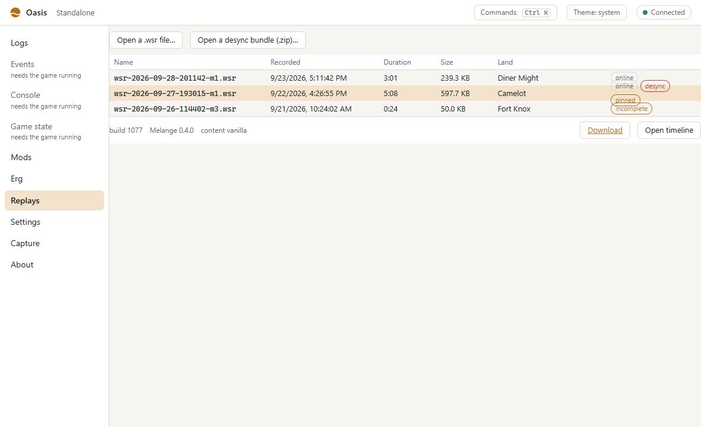
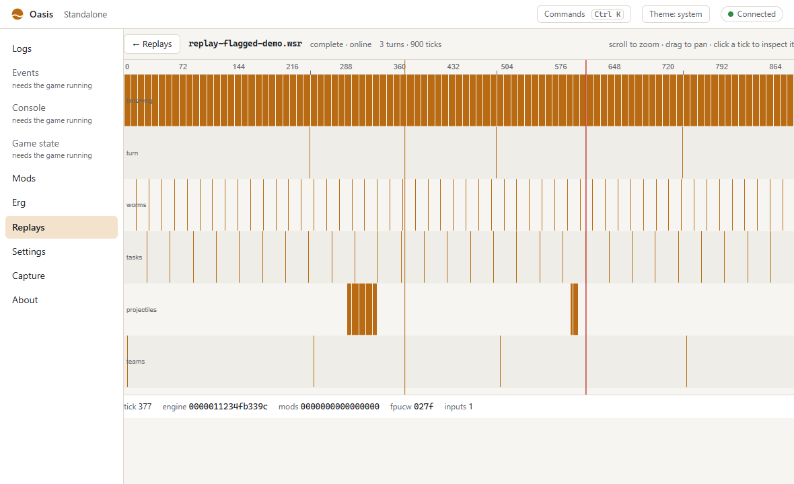
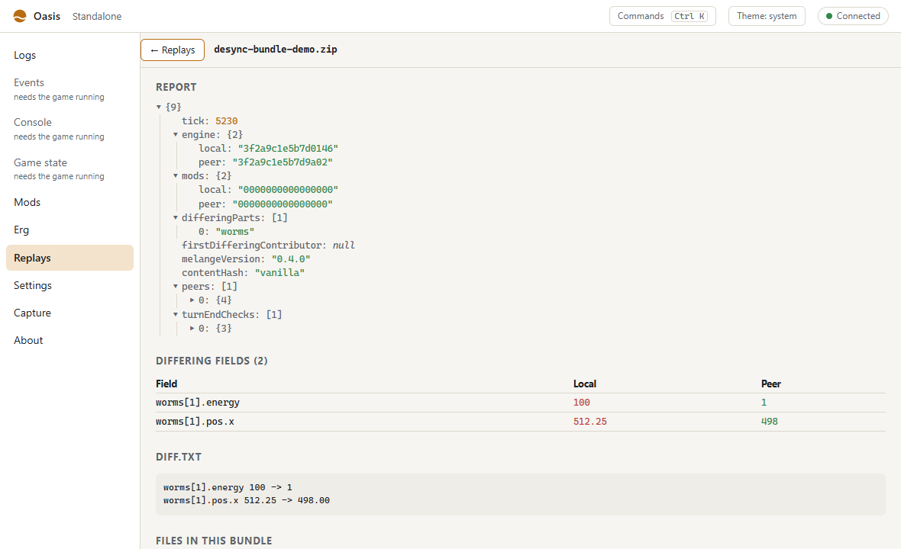

# Wormsign

Wormsign is the match's tick clock and state hash. A tick is one 20 ms step of the game's simulation, 50 per second. At the end of each tick Wormsign hashes the logic RNG, the turn, the worms, the scheduled tasks, the projectiles and the teams (the *engine* hash), plus whatever mods feed in (the *mods* hash). Two machines that agree on a tick's hashes agree on the game state at that tick.

## Replays

A recording (`Documents\Melange\replays\*.wsr`) holds what is needed to play a local match again: the seeds, the
random draws made in the menus before the match, every input with its time, the hash of every tick and a fingerprint
of the match setup. A replay plays the match again with those inputs and compares each tick with the recording.

1. Open the overlay panel *Wormsign/Replay* at the main menu and arm a recording.
2. Start a **Quick Game from the main menu**. The replay needs the same route into the match as the recording: the
   match setup is rebuilt from the recorded menu draws, not written directly.
3. At the first tick the setup (level, land, theme, scheme and teams) is checked against the recording. If it
   differs, the replay stops with "setup differs" and names the first difference. It never reports that as a
   divergence.
4. While the replay plays, your own inputs are ignored and the recorded ones are sent at their recorded times.
   Pause, change the speed (0.25x to 8x) or run to a tick. Running to a tick that has already passed needs a restart:
   *Restart* arms the recording again, and once you quit the match you start the Quick Game again.
5. The panel counts the ticks compared and matched. At the first tick that differs it shows "Diverged at tick N" and
   which parts of the state differ (*diff*). The replay keeps playing so you can watch what happens next.

Arming is refused while you are in a lobby or online, during a match, for a recording of an online match, for a
recording made with another game build, and for one made with different mod content (unless
`[Wormsign] ReplayAnyContent=1`). A recording whose hash version differs from this build's plays without being
compared.

The `wormsign.replay` test command does the same from scripts: `arm <file>`, `disarm`, `pause`, `resume`,
`speed <x>`, `runto <tick>`, `restart [tick]` and `status`.

| Setting (`[Wormsign]`) | Default | |
|---|---|---|
| `ReplayAnyContent` | 0 | 1 replays a recording made with different mod content |
| `ReplayPassLocal` | 0 | 1 lets local-only inputs (the camera) through while a replay plays; by default every live input is ignored |

## Record layouts in a `.wsr` file

The container (chunks, compression, index, recovery of truncated files) is described in `src/wormsign/format.h`.
These are the payloads of the record chunks, little-endian and packed:

| Chunk | Payload |
|---|---|
| `SEED` | `n × {u8 kind, u32 value, u32 caller, u32 t}`: `kind` 0 is the logic RNG, 1 the second RNG; `caller` is the return address of the seed call |
| `PDRW` | `n × {u8 rng, u32 ret, u32 stateAfter, u32 bits}`: the random draws made before the match, in order; `bits` is the result (an integer or float bits) |
| `INPT` | `n × {u8 type, u16 id, u32 a, u32 b, u32 time, u32 callT, u32 caller, u8 strLen, strLen bytes}`: `type` 0-5 is message, int, two ints, float, two floats, string; `a` and `b` are the values (float bits for floats); `time` is when the input takes effect and `callT` the logic time of the call |
| `TICK` | `u32 firstTick`, then records: `0` followed by `{u64 engine, u64 mods, u64 c[6], u32 rngLogic, u32 rng2, u16 fpucw, u16 inputs}` for one tick (the next tick number follows), or `1` followed by `u32 n` for `n` missing ticks |
| `SETP` | JSON: `v`, `level`, `landFile`, `landTheme`, `dataBank`, `timeOfDay`, `levelDetails`, `lastScheme`, `schemeName`, `scheme` and `init` (16-digit hex hashes of the scheme and team setup), `teams: [{name, worms}]` |

The `HEAD` chunk's `contributors` (an array of `{name, version}`) decides whether a replay also compares the `mods`
hash: only when the recording and the running game have the same set.

## Desync detection

In an online match every player runs the same simulation from the same inputs. When one machine's state drifts, the game notices only at the end of a turn, and then ends the match with "This session is no longer available". Wormsign compares the hashes of every tick with the other Melange players in the lobby, so a desync is reported at the tick where it happened, usually within a second.

- **Who it talks to.** Each Melange player with `[Wormsign] Exchange=1` writes the lobby member key `mlg.ws=1`. Hashes go only to members whose `mlg.ws` is the same version. A player without Melange, or with Wormsign off, gets nothing: Melange never sends them a packet, and a match against them is byte-for-byte the same on the wire as without Melange.
- **How.** Steam P2P channel 5, which the game neither uses nor reads. A batch of tick hashes goes out every half second, about 1.2 KB/s per player.
- **What it compares.** The engine hash, always. The mods hash, when both players have the same mod contributors; otherwise the *Wormsign/Peers* panel says "mod contributors differ".
- **What a desync does.** Nothing to the match: Wormsign never pauses or ends it, and the game's own turn-end check keeps working as before. Wormsign shows a message ("Desync at tick 5000 (worms) with *player*, bundle saved"), writes the log, and saves a desync bundle. `[Wormsign] OnDesync=bundle-only` keeps the message off the screen.

The overlay panel *Wormsign/Peers* lists every lobby member: whether hashes are exchanged ("no exchange" for a player without it, "version mismatch" for another protocol), the last tick both sides compared, how many ticks the other player is behind, and, after a desync, how long the two have stayed apart.

### The desync bundle

`Documents\Melange\replays\desync-<date>-p<process>-m<match>-t<tick>.zip` holds:

| File | Content |
|---|---|
| `report.json` | The tick, both engine and mods hashes, which engine parts differ, the first differing mod contributor, every lobby member's exchange state, Melange version and content hash, and the game's own turn-end checks during the match |
| `diff.txt` | One line per field that differs at that tick, ours first: `worms[3].energy 100 -> 1` |
| `detail-local.json`, `detail-peer.json` | The state at that tick on both machines, as far as it is known |
| `match.wsr` | The match recording, when one is kept |
| `logs/Melange.log`, `logs/session.jsonl` | The last two minutes of both logs |
| `mods.json`, `sysinfo.txt` | The enabled mods, and the system information of *Save logs as...* |

Bundles follow the redaction of *Save logs as...*: SteamIDs and IP addresses are replaced with a hash that is different in every bundle, and the Windows user and computer names are replaced. *Save logs as...* also includes the newest bundle.

When the game's own turn-end check later fails, the log and the panel say how far behind it was: "Wormsign flagged tick 5000; the engine's turn-end check failed at tick 7488 (reason 5, Random's dont match)".

### Testing a mod's determinism

A sim mod must do the same thing on every machine. A mod that reads something only one machine has (a local setting, the camera, the time) desyncs the match. `dist\Mods\desync-probe` (disabled by default) is a small content mod for trying the detector: on the local event `sim.test.desync` it changes a global of its own (kind 0) or draws an extra number from its random stream (kind 2). Enable it on both machines of a LocalNet or Steam match, raise the event on one of them, and the detector reports the tick with the mod's contributor named.

## For modules (C++)

`melange/wormsign.h` has the tick clock, the hashes and the observers:

- `OnDivergence(fn, user)`: called on the main thread with a `Divergence` for every desync with another player (`Source::Peer`) or a replay (`Source::Replay`): the tick, both hashes, the engine parts that differ (`compMask`), the first differing contributor and the other player's SteamID. `bundle` is empty then; the bundle is written a few seconds later.
- `AddContributor(name, fn, user)` feeds a module's own state into the mods hash.

Client Lua has `wum.wormsign.onDivergence(fn)` and the event `wormsign.divergence` ([lua-api.md](lua-api.md)).

The automation verb `wormsign.peers` logs the exchange with each lobby member and the packet counters; `wormsign.stats` logs the tick clock and the hash cost.

## The exchange protocol, version 1

Little-endian. Every packet is at most 1100 bytes and starts with an 8-byte header: the magic `WSX1`, `u8 kind`, `u8 protocol` (1), `u16` total length. A packet with a wrong magic, protocol or length is dropped. `matchKey` is an FNV-1a-64 of the lobby owner's SteamID and the lobby id.

| Kind | Sent | Content after the header |
|---|---|---|
| 1 `HELLO` | unreliable; every second until the other side has ours, then every 10 s | `u32 engineHashVersion, u64 matchKey, u32 firstTick, u64 contributorListHash, u8 flags` (1: we have yours, 2: names cut), `str8 melangeVersion, str8 contentHash16, u8 n`, n × `{str8 name, u32 version}` |
| 2 `HASHES` | unreliable, every 25 ticks | `u64 matchKey, u32 firstTick, u8 n` (≤ 50), `u64 presentMask`, n × `{u64 engine, u64 mods}` for ticks `firstTick..firstTick+n-1`; each batch repeats the previous one's last 15 ticks |
| 3 `COMPS?` | reliable, on a desync | `u64 matchKey, u32 tick` |
| 4 `COMPS` | reliable, the answer | `u64 matchKey, u32 tick, u8 have, u64 engine, u64 mods, u64 components[6], u8 n`, n × `u64` per contributor, in `HELLO` order |
| 5 `DETAIL?` | reliable, on a desync | `u64 matchKey, u32 tick` |
| 6 `DETAIL` | reliable, the answer | `u64 matchKey, u32 tick, u16 index, u16 count, u32 total, u16 len, bytes`: the tick's detail record as JSON, at most 64 KB in 1 KB chunks |
| 7 `FLAG` | reliable, on a desync | `u64 matchKey, u32 tick, u64 engine, u64 mods, u64 components[6]`: the sender's view of the first differing tick |

`str8` is a length byte and that many bytes. The engine components are, in order, time and logic RNG, turn, worms, tasks, projectiles and teams. The contributor list hash is FNV-1a-64 over each name, a zero byte and its `u32` version. Detail records are answered at most 4 times a minute per player, component requests 8 times, and only for the current match; nothing received is ever run or used as a path.
