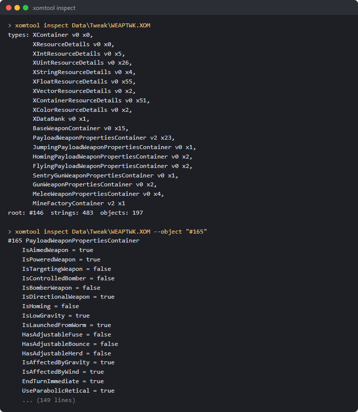
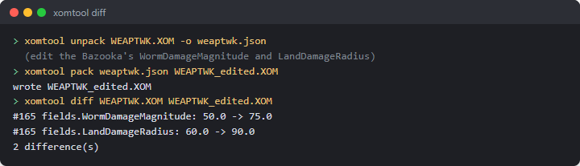

# Sieve (`xomtool`)

`xomtool` reads and writes the game's `MOIK`/`TYPE`/`STRS`/`CTNR` container format ("XOM": weapon
data, bundles, panel textures, meshes). It ships two builds with the same behaviour:

- **C++**, `dist\tools\xomtool.exe` (built by `build.ps1`), backed by `src/xom` (a small, portable
  library: no OS calls, builds for Win32, Linux and WebAssembly).
- **Python**, `tools\xom\xomtool.py` (stdlib only), for scripting without a compiler.

Both read and write the same `melange-xom/1` JSON model (`tools/xom/xom.py`'s `to_json`/`load`):
`unpack`, `bank`, and every glTF conversion give byte-identical output between the two builds.
The one exception is a PNG file written by `convert ... --out texture.png`: the C++ build uses
`stb_image_write` and the Python build a small hand-rolled encoder, and their compressed bytes
differ even though the decoded pixels are always identical (`tools/xom/parity_test.py` checks
this the right way: pixel comparison for PNG output, byte comparison for everything else,
including the glTF JSON and binary buffer, since those come from this tool's own deterministic
layout code and not a third-party codec).

`clone`, the `--nodes` forms of `convert` and the image, deform and UV-layout tooling are C++ only.

## Subcommands

```
xomtool unpack <in.xom|.xan> [-o <out.json>] [--split <dir>]
xomtool pack <in.json|dir> <out.xom>
xomtool inspect <in.xom> [--object <NAME|#N>] [--type <TypeName>]
xomtool diff <a.xom> <b.xom>
xomtool convert <texture.png> --into <file.xom> --as <Name> [--section N] [--mips=0|1] [-o <out.xom>]
xomtool convert <Name> --from <file.xom> --out <texture.png> [--mip N]
xomtool convert <mesh.gltf|.glb> --into <file.xom> --as <Name> [--section N]
                [--material-from <Name>] [--material-file <file.xom>] [--texture <png>] [-o <out.xom>]
xomtool convert <mesh.gltf|.glb> --bundle <out.xom> --as <modId.Name> --section <476..519>
                [--material-from <Name> --material-file <Bundl09.xom>] [--texture <png>] [--scene-bin N]
                [--nodes keep|flat|auto]
xomtool convert <Name|#N> --from <file.xom> --out <mesh.gltf> [--nodes]
xomtool clone <VanillaName> --from <Bundl09.xom> --bundle <out.xom> --as <modId.Name> --section <476..519>
              [--texture <k>=<png> ...] [--deform <script.json>] [--uv-layout <dir>] [--out-gltf <file>] [--allow-shared]
xomtool clone <VanillaName> --from <Bundl09.xom> --list-images | --tree
xomtool bank --from <src.xom> --object <BaseName> --as <NewName> [--set Field=value ...] --out <out.xom>
xomtool report <in.xom> -o <out.md>
```

Exit codes: `0` ok, `1` usage, `2` input error, `3` write refused. Every error names the object
(index or resource name) and the field it was about, where one is involved.

### `unpack` / `pack`

`unpack` decodes a `.xom`/`.xan` file to the JSON model described in `tools/xom/xom.py`'s module
docstring: object references as `{"ref": n}`, byte arrays as `{"hex": "..."}`, a non-finite float
as `{"f32": "<hex bits>"}` or `{"f64": "..."}`, and everything else as plain JSON. `pack` is the
exact inverse and refuses (exit 3) if the objects it is given cannot be grouped into TYPE-table
order, or a field the schema expects is missing.

```
xomtool unpack Data/Tweak/WEAPTWK.XOM -o weaptwk.json
# edit weaptwk.json ...
xomtool pack weaptwk.json weaptwk_edited.xom
```

`unpack --split <dir>` writes `<dir>/index.json` (the header, TYPE table, string table and an
`objects` array of `{"type", "file"}` pointers) plus one `<dir>/objects/NNNNNN.json` per object,
numbered by position - handy for putting a large file under version control one object at a time.
This is simpler than "one file per named resource" (not every object has a name, and the split
form is fully reversible either way): `pack <dir> <out.xom>` reassembles it exactly.

### `inspect` and `diff`

`inspect <file>` alone lists the TYPE table and the root/string/object counts. `--type X` or
`--object NAME`/`--object #N` (1-based) narrows to matching objects and, given `--object`, prints
every field. `diff a.xom b.xom` compares them object by object (by position) and prints one line
per changed, added or removed field, labelled by the object's `ResourceId` or `Name` when it has
one:

```
$ xomtool diff WEAPTWK.XOM WEAPTWK_edited.XOM
#112 kWeaponBazooka fields.WormDamageMagnitude: 50.0 -> 75.0
1 difference(s)
```





### `convert` (textures)

```
xomtool convert weapon.png --into weapons.xom --as MyIcon.tga
xomtool convert MyIcon.tga --from weapons.xom --out weapon.png [--mip 0]
```

Texture layout (validated against all 3110 shipped `XImage`s):
Format 0 is RGB8, Format 1 is RGBA8, mip levels are back-to-back with no padding, and **rows are
stored bottom-up** (confirmed in game on the weapon panel atlas) while a PNG is top-down, so every conversion flips rows; channel order (RGB) is kept as-is
either way. `--into` appends a new, fully independent `XImage` (mips regenerated with a 2×2 box
filter unless `--mips=0`, in which case only the given level is stored - the lossless leg of the
round trip: PNG → XImage → PNG at level 0 is exact). `--from`/`--out` finds an existing `XImage`
by its `Name` field and extracts one mip level (default 0) to PNG.

### `convert` (static meshes)

```
xomtool convert model.gltf --into weapons.xom --as MyMod.Payload \
    --material-from Bazooka.Payload --material-file Data/Bundles/Bundl09.xom \
    --texture mytexture.png
xomtool convert MyMod.Payload --from weapons.xom --out model.gltf
```

Maps the object graph 1:1 onto glTF:

```
XMeshDescriptor -> XGraphSet -> XInteriorNode -> XGroup -> XShape
    -> XIndexedTriangleSet {XCoord3fSet, XNormal3fSet, XTexCoord2fSet, XIndexSet}
```

- **One primitive per `XShape`.** `--from`/`--out` walks the mesh's `"world"` graph entry (or its
  first entry, if none is named `"world"`) and turns every `XShape` it finds into one glTF mesh
  and node, with that node's `matrix` set from the `XGroup` chain above it (`XTransform`'s own
  cached `Matrix` field is used directly - see the note below - so no Euler-angle math is
  needed for this direction).
- **Indices are u16 only**: a primitive with more than 65535 vertices is refused (exit 3).
- **`--material-from <Name>`** deep-copies that resource's `XShape.Shader` subgraph (the shader,
  its texture stage(s), material and lighting objects) from `--material-file` (or `--into`'s own
  file, if `--material-file` is omitted) into the output, unchanged, and every new `XShape` uses
  the copy. **`--texture <png>`** additionally replaces the pixels of the one `XImage` reachable
  through the copied shader's `TextureStages[*].Texture` (refused if there is not exactly one -
  the well-defined case a template mesh's shader actually has, not a general material editor).
  Without `--material-from`, new shapes get no shader (`Shader` ref 0).
- **Node transforms**: `--into` writes the node's matrix into a new `XTransform`'s `Matrix` field
  exactly (this is what the engine renders from). Its
  `Translate`/`Scale` fields are derived from that same matrix; `Rotate` is written as `(0,0,0)`
  rather than decomposed, since nothing here reads it back - if your own tooling depends on
  `Rotate`/`RotateOrder` being accurate for a mesh built by `xomtool`, decompose `Matrix` yourself.
- **Deliberate limitation:** `--into` only *appends* a new, self-contained run of objects and new
  TYPE-table entries; it refuses (exit 3, naming the class) if the target file already defines any
  class the new mesh needs (`XShape`, `XGroup`, `XTransform`, ...). Build one small, purpose-built
  output file per mesh (as the examples above do) rather than injecting into an existing bundle
  with meshes of its own already - doing that safely needs re-indexing every `Ref` field in the
  file, which is future work, not this version's scope.
- **Loading in game:** `LoadBank` only accepts an `XDataBank`, so a `--into` file is not loadable by
  itself. A mod's mesh is loaded by Melange's mesh loader (the manifest's `meshes` field, see
  `docs/spice.md` and `docs/meshes.md`) from a bundle-shaped bank: see `--bundle` below.
- Animation and a Blender addon are not in this version; a skinned mesh is reached by cloning a vanilla one (see `clone` below), not by `convert`.


#### `convert ... --bundle` (a loadable mesh bank)

```
xomtool convert model.gltf --bundle kindjal.NailBat.xom --as kindjal.NailBat --section 476 \
    --material-from BaseballBat --material-file Data/Bundles/Bundl09.xom --texture nailbat.png [--scene-bin 8]
```

Writes a complete mesh bank from nothing (no seed file): the shape `Meshes.LoadModBank` / the engine's section
loader read (see `docs/meshes.md`). The root object is an `XGraphSet` whose single entry is
`{Guid 99cc436e6fbef54b85d2bfcdf9ae4283, Graph -> XMeshDescriptor, Name = <modId>.<Name>}`; the descriptor
carries `ResourceId`, `SectionId` (`--section`, 476..519 only) and `Flags 8`, and its own `XGraphSet` has a
`"world"` entry with the geometry-graph GUID `6ae6dbe4fa866b45a73ff9130e12dfeb` pointing at
`XInteriorNode -> XGroup -> XShape ...`. The file header comes from `--material-file`, and the TYPE table
lists only the classes the bank uses (counts are computed). The output matches, object for object, the
hand-built `kindjal.NailBat.xom` that loaded in game (`xomtool diff` reports 0 differences).

- `--as` must be `<modId>.<Name>`; `--material-from` needs `--material-file`; `--texture` needs `--material-from`.
- **One mesh per bank.** There is no `--bundle-append`: use one file and one `--section` per mesh.
- `--scene-bin N` (0..87) is only validated. The scene bin is not stored in the file; it is the loader's argument
  (`mesh.load <bank> <modId> <sceneBin>`, default 8).
- Without `--material-from` the shapes have no shader (the mesh will not render in game).
- `--texture` needs a shader with exactly one texture; a vanilla shader with several (e.g. `GasCanister`) is
  refused, pick another mesh's material (e.g. `Grenade.Payload`).

The `--into` form now also writes the `"world"` entry with the same geometry GUID instead of a zero GUID.

`convert <Name> --from <file.xom> --out <texture.png|mesh.gltf>` also accepts `#N`, the 1-based object index
shown by `inspect`/`unpack` (texture form: an `XImage`), for the case where several images share a name -
Bundl09 has ten called `maya:file11/-1`: `xomtool convert "#6819" --from Bundl09.xom --out bat.png`.

### `convert ... --bundle` with several nodes (animation-driven names)

A vanilla mesh is a tree of named nodes, and the clips that animate it address those nodes by name: ClusterBomb's `spin`
clip drives `cluster` and `cluster|flap1` .. `flap4`, the Shotgun's draw clip moves `shotgun_pump`, and SentryGun is a deep tree
(`spindle_ring`, `leg_1`, `spindle`, `gun`, `barrel`, `ball`, ..., plus a `$animTex0` group for texture animation). A new
static model that wants those clips has to keep those names. `convert --bundle` therefore keeps the glTF node tree:

```
xomtool convert Shotgun --from Data/Bundles/Bundl09.xom --out shotgun.gltf --nodes     # the vanilla tree, names and all
# ... edit the meshes in Blender, keep the node names ("Shotgun", "shotgun_pump", "eject", "Payload_Spawn") ...
xomtool convert shotgun.gltf --bundle kindjal.Shot.xom --as kindjal.Shot --section 493 \
    --material-from Shotgun --material-file Data/Bundles/Bundl09.xom [--nodes keep|flat|auto]
```

- **Layout written** (what `Shotgun`, `ClusterBomb` and `SentryGun` have in Bundl09): `XInteriorNode` (named `<modId.Name>`)
  -> one `XGroup` per glTF node, named after it, with an `XTransform` as its `Core` (the node's local matrix) -> its first
  child is a Core-less `XGroup` `<name>Shape` holding the node's `XShape`s, followed by the child nodes. A node with no
  mesh (an empty in Blender) is a locator (`eject`, `Payload_Spawn`, `Smoke1`): the group and its transform only.
  Reading the bank back with `clone --tree` shows the same tree as the vanilla mesh; the self-test rebuilds ClusterBomb,
  Shotgun and SentryGun from their own trees and compares every node name and parent.
- `XTransform.Rotate` carries the node's Euler angles (radians, `R = Rz * Ry * Rx`, `RotateOrder 0`), recovered from the
  matrix; `Matrix`, which is what renders, is the glTF matrix exactly. The convention was fitted to the 56 vanilla
  `XTransform`s of Bundl09 that rotate about two or more axes (all agree to 3e-3). A clip sets only the channels it
  animates and the rest keep the stored value, so a rest rotation has to be in `Rotate` too. (The older flat form writes
  `Rotate` as zero; it is left alone so the two builds stay byte-identical.)
- **`--nodes keep|flat|auto`** (default `auto`): `auto` keeps the tree when the glTF has more than one node and writes the
  old flat layout (one group per mesh, named `<id>_group_<i>`) for a lone node, which is what the proven single-mesh bank
  is; `keep` forces the tree, `flat` forces the old layout. A node name used twice draws a warning: clips address nodes by
  name (a path such as `cluster|flap1`), so duplicates are ambiguous. When `auto` picks the tree it prints a note saying
  so: the tree layout is built from the vanilla trees but has not been loaded in game, only the flat one has. Camera and
  light nodes with no mesh and no children (a Blender export's furniture) are dropped rather than written as locators.
- glTF: a node's mesh is its shape; a mesh name becomes the `XShape` name (`<node>Shape_<material>` in vanilla). A node
  carries one mesh in glTF, so a node that owns several shapes is exported with the first as its mesh and the others as
  child nodes marked `"extras": {"xomShape": true}`; `convert` folds those back into the owning node, so an
  export / edit / convert round trip keeps the shape count per node. Node transforms may be `matrix` or TRS.
- `convert <Name> --from F --out m.gltf` without `--nodes` is unchanged (flat, matrices composed, as the Python build
  writes it). `--nodes` and `--nodes keep|flat|auto` are C++-only.
- Not authored: animation clips (the new bank has none; the vanilla clip is addressed through the vanilla mesh, see
  [Unverified](#unverified-in-game)), skins/bones, and bounds (written as zero, as before).

### `clone` (vanilla meshes: static, rigid-hierarchy and skinned)

```
xomtool clone <VanillaName> --from <Bundl09.xom> --bundle <out.xom> --as <modId.Name> --section <476..519>
              [--texture <k>=<png> ...] [--deform <script.json>] [--uv-layout <dir>] [--out-gltf <file>] [--allow-shared]
xomtool clone <VanillaName> --from <Bundl09.xom> --list-images | --tree
```

Copies a vanilla `XMeshDescriptor` and everything it reaches into a loadable one-mesh bank: the starting point for "the
Sheep, but dark grey and lumpier", where `convert --bundle` (which writes new static geometry) cannot go because a skinned
mesh is more than geometry. The file header is the vanilla file's; the descriptor's `ResourceId` and `SectionId` are
patched (`Flags` kept); the root `XGraphSet` entry `{99cc436e6fbef54b85d2bfcdf9ae4283, Graph -> descriptor, Name}` is added
exactly as `convert --bundle` writes it; the descriptor's own graph set keeps its `"world"` entry (GUID
`6ae6dbe4fa866b45a73ff9130e12dfeb`, the one the engine fetches) and every other entry. The result is read back strictly
before the command reports success. `--as` and `--section` follow the same rules as `convert --bundle`.

What is copied is the whole reference closure of the descriptor, not a list of known classes: geometry
(`XIndexedTriangleSet`, `XCoord3fSet`, `XNormal3fSet`, `XTexCoord2fSet`, `XIndexSet`), the node tree (`XInteriorNode`,
`XGroup`, `XTransform`), shaders and textures (`XSimpleShader`, `XMaterial`, `XOglTextureMap`, `XImage`, ...), a skin's
`XSkin`, `XSkinShape`, `XBone`s, `XJointTransform`s and `XPaletteWeightSet`, and the data the graph set carries
(`XAnimClipLibrary`, `XExpandedAnimInfo`, collision, path-finder and position data). What it came to for the three meshes
the self-test and the prototype banks use:

```
cloned Sheep (#79 in Bundl09.xom) as "kindjal.ProtoSheep", section 490: 68 objects
  closure by class: XMeshDescriptor 1, XAnimClipLibrary 1, XExpandedAnimInfo 1, XGraphSet 2, XInteriorNode 1,
    XGroup 15, XIndexedTriangleSet 1, XCoord3fSet 1, XNormal3fSet 1, XTexCoord2fSet 1, XPaletteWeightSet 1,
    XIndexSet 1, XTransform 1, XJointTransform 14, XSkin 1, XSkinShape 1, XBone 14, XCollisionGeometry 1,
    XCollisionData 2, XFortsExportedData 1, XDetailObjectsData 1, XSimpleShader 1, XMaterial 1, XLightingEnable 1,
    XImage 1, XOglTextureMap 1
  note: owns #438 XAnimClipLibrary "XCULLEDSheep", 10 clip(s)
```

Dynamite (static, 2 shapes, 2 images) is 38 objects, ClusterBomb (rigid hierarchy: body and four flap nodes, 2 images) 64,
Sheep (skinned, 14 bones, 1 weight set, 10 clips) 68. Every copied object equals its source field for field apart from
renumbered references (the self-test compares all of them).

**What is refused.** A closure that reaches another `XMeshDescriptor`, or an `XAnimClipLibrary` that some object *outside*
the closure also references, is refused with the object and the chain of references that reaches it; `--allow-shared`
copies it anyway (the report then says "duplicated shared"). An `XAnimClipLibrary` reached only through the mesh's own
graph set is not shared: every animated vanilla mesh keeps its clips there (Sheep: `XCULLEDSheep` with Run, Jump, Run2Sink,
Sink, ...), so it is the mesh's own data, copied with it and reported as `owns ...`. (Refusing every clip library would
make a skinned clone impossible, which is why the rule is about sharing rather than presence.) An object xomtool could not
decode, in the undelimited tail of the file or an opaque payload, is refused with its index and class and the reference
chain that reaches it, because its references cannot be followed or renumbered. None of this fires on Bundl09: all 171 of its
`XMeshDescriptor`s clone (and re-read strictly) without `--allow-shared`.

#### Images and textures

`--list-images` (no bank written) prints every `XImage` in the closure in graph order (a depth-first walk from the
descriptor: shape 0's shader and texture before shape 1's), with its index `k`, object number, size, format, mip count and
the shapes whose shader reaches it:

```
$ xomtool clone Dynamite --from Bundl09.xom --list-images
Dynamite: 2 image(s), in graph order (the k of --texture k=<png>)
  [0] #6824 "maya:file11/-1"  64x64 RGB8  mips=7  used by: dynamiteShape_dynamitemain_shader
  [1] #6826 "maya:file12/-1"  32x32 RGB8  mips=6  used by: dynamiteShape_dynamitefuse_shader
```

`--texture k=<png>` (repeatable) replaces image `k`'s pixels. The picture is made to fit the original: a different size is
resampled to the original width and height (area average down, bilinear up), RGB/RGBA is converted to the image's own
format, and the mip chain is regenerated with the same 2x2 box filter `convert` uses (an image stored with one level stays
single-level). Name, flags and every other object are untouched, which the self-test checks object by object. Get the
vanilla picture as a starting point with `xomtool convert "#6824" --from Bundl09.xom --out dyn.png` (the `#N` printed above).
An image shared by several shaders (ClusterBomb's four flaps share one) is one object, so one `--texture` recolours all.

#### `--tree`

Prints the node tree the engine renders: node class and name, local position, shapes with vertex and triangle counts, their
shader and the image indices, and a skin's skeleton. It shows the names a clip can address and what `--texture` indices
belong to which part.

#### `--deform <script.json>`

Vertex edits that keep the vertex count and order, the index sets, the UVs and the skin weights: only `XCoord3fSet`
positions change, then the normals of the vertices the edit reached are recomputed and the bounds are refreshed. Because
nothing a vertex *index* refers to changes, a deformed clone is a drop-in for the original: same bones, same weights, same
clips, same texture layout.

```json
{
  "select": "*",
  "ops": [
    { "op": "region", "box": [[-7.5, -7, -8], [7.5, 9, 7]], "falloff": 2,
      "then": [ { "op": "push", "dist": 0.4 },
                { "op": "noise", "amp": 0.12, "freq": 0.5, "seed": 7 } ] }
  ]
}
```

The script is an array of ops, or an object with `ops` and a default `select`. Ops run in order; each runs on the shapes its
`select` names, a glob (`*`, `?`, case-insensitive) or an array of globs, matched against the shape's name and the names of
the nodes above it (`"wool*"`, `"flap?"`, `"gun"` for everything under node `gun`); default `*`. Positions are the shape's own
stored coordinates: the bind pose of a skinned shape, node-local for a rigid one (see `--tree` for the node a shape is in).

| op | fields | does |
|---|---|---|
| `scale` | `s` (number or `[x,y,z]`), `about` | scales about `about` (default: the selection's bounds centre) |
| `translate` | `t` `[x,y,z]` | moves |
| `bend` | `axis` (`x`/`y`/`z`, default `y`), `dir` (default the next axis), `amount` (degrees), `length`, `about` | bends the selection into an arc that turns `amount` degrees over `length` toward `+dir`, starting at `about` (default: the bounds minimum along `axis`, centred on the others; `length` defaults to the remaining extent); beyond the arc the shape continues straight, before `about` nothing moves |
| `push` | `dist` | moves each vertex `dist` along its normal (negative = in) |
| `noise` | `amp`, `freq` (cycles per unit), `seed`, `mode` (`normal` default, or `vector`) | value noise of the position: a pure function of position and seed, so the result is the same every run, and vertices at one position move together (seams stay closed) |
| `region` | `box` `[[x0,y0,z0],[x1,y1,z1]]` (or six numbers), `falloff`, `then` `[ops]` | runs `then` only inside the box, fading smoothly to nothing over `falloff` outside it; default pivots inside are the box centre; `select` is not allowed on nested ops |

`push` and `noise` use the welded vertex normal (summed over vertices at the same position), so a UV or hard-edge seam does
not tear. Which way a mesh's stored normals face relative to its triangle winding is detected per shape, so clockwise and
counter-clockwise meshes both push outward. Normals are recomputed area-weighted per index (indices that share a vertex
share its normal; split vertices keep their own) for the vertices of every triangle that has a moved corner; the rest keep
the artist's normals. Bounds: each triangle set's `BoundBox` becomes the exact new box, and each scene-graph sphere with a
radius gains the largest displacement (spheres only ever grow). The whole script is validated and run before anything is
written: a bad op, a selector that matches nothing, a coordinate array drawn by two shapes of which only one is selected (or
which differ in their index or normal sets, since one edit carries one triangle list), or
a result that is not finite fails with a message and the bank is not written.

*Skinned meshes.* A skinned shape is deformed in its stored (bind-pose) coordinates, and the `XBone.PoseMatrix` values and
`XPaletteWeightSet` weights are left alone, which is what keeps the clips working. The engine blends each vertex by its
bone weights at run time, so a vertex displaced by `d` in bind pose is displaced by a bone-weighted blend of rotations of
`d` when posed. Neighbouring vertices that are weighted to bones that bend against each other (hips, shoulders, knees) turn
their displacements apart, and a displacement that is large next to the spacing of the vertices can open a thin gap or a
crease there. Keep deforms near joints small relative to the limb, and fade them out with a `region` `falloff`; a global
`push` of a few percent of the limb thickness is safe, a bend or a 30 % scale of a limb is not.

#### `--uv-layout <dir>`

For each image a shape samples, writes three files into `<dir>`: `image<k>.original.png` (the texture at its own size),
`image<k>.layout.png` (the same, enlarged by an integer factor so the longest side is at least 512 pixels, with every
triangle drawn as an outline, one colour per UV island) and `image<k>.json`:

```json
{ "format": "melange-uvlayout/1",
  "image": { "index": 0, "name": "maya:file11/-1", "width": 128, "height": 128, "mipLevels": 8, "format": "RGB8" },
  "originalPng": "image0.original.png", "layoutPng": "image0.layout.png", "layoutScale": 4,
  "convention": "u to the right, v up: native pixel x = u * width, PNG row y = (1 - v) * height ...",
  "outOfRangeUvs": false,
  "islands": [ { "id": 0, "shape": "sheepShape_sheep_material", "triangles": 54, "vertices": 32,
                 "uvBounds": [0.38, 0.76, 0.74, 0.99], "pixelBounds": [49, 1, 95, 32], "color": "#ff4040" }, ... ] }
```

An island is a set of triangles joined by shared vertices within one shape (a vertex shared across a UV seam is two vertices
here, so seams separate islands). Paint on the original (or the layout, then remove the outlines), save a PNG of the same
proportions and feed it back with `--texture k=`. The layout is drawn from the vanilla clone, before any `--texture` of the
same command. The overlay uses the stored orientation (rows bottom-up in the file, `v` up), which is the orientation the
panel atlas was confirmed in game with; no mesh has been checked in game against this layout.

#### `--out-gltf <file>`

Writes the clone's geometry as glTF (`<file>` and a sibling `.bin`) after the texture and deform steps, for a preview in any
viewer and as a starting point for `convert --bundle`: the node tree with names and local matrices, static parts as they
are, skinned parts in bind pose and without their skin or bones (a Sheep exports as one lumpy sheep-shaped mesh, no
skeleton). It is the same writer as `convert <Name> --from F --out m.gltf --nodes`.

#### The prototype banks

```
xomtool clone Sheep       --from Bundl09.xom --bundle kindjal.ProtoSheep.xom       --as kindjal.ProtoSheep       --section 490 \
    --texture 0=sheep_dark_grey_red_eyes.png --deform sheep_deform.json
xomtool clone Dynamite    --from Bundl09.xom --bundle kindjal.ProtoDynamite.xom    --as kindjal.ProtoDynamite    --section 491 \
    --texture 0=dyn0_red.png --texture 1=dyn1_red.png
xomtool clone ClusterBomb --from Bundl09.xom --bundle kindjal.ProtoClusterBomb.xom --as kindjal.ProtoClusterBomb --section 492 \
    --texture 0=cb0_teal.png --texture 1=cb1_teal.png
```

`xomtool inspect` reads them as bundles: root `XGraphSet` -> `XMeshDescriptor` (SectionId 490/491/492, Flags 8) ->
`XGraphSet` with the `"world"` entry; and `meshbank_selftest --bank <file> --mod kindjal` accepts all three.

### `bank`

```
xomtool bank --from Data/Tweak/WEAPTWK.XOM --object kWeaponBazooka --as kWeaponMegaBazooka \
    --set WormDamageMagnitude=120 --set PayloadGraphicsResourceID=Cow.Payload --out megabazooka.xom
```

Builds a minimal, one-entry `XDataBank` (`XContainerResourceDetails` + `XDataBank` +  a copy of
the named container, with any `--set` overrides applied) from a container already present in
`--from`, matching what `melange::weapons::registry`'s `bank` manifest field loads
(see [weapons.md](weapons.md)). `--set Field=value` writes a bool/int/float/string field by name
(refused, exit 2, if the field does not exist or is a type `--set` cannot write, such as a `ref`
or an array); the field's own type decides how `value` is parsed.

### `level`

```
xomtool level unpack <in.xan> [--xom <level.xom>] [--hmp <in.hmp>] -o <scene.json> [--blobs <dir>]
xomtool level build --patch <patch.ergpatch.json> --game <dir> --out <dir>
xomtool level diff <a.json> <b.json>
```

The C++-only counterpart to Erg's own scene model (`src/erg/scene.h`, `patch.h`): `unpack` reads a base map's
`.xan` (plus its level `.XOM` and `.hmp` when given) into the same `erg-scene/1` JSON [erg.md](erg.md) works with,
with voxel and height-map blobs as separate files next to it; `build` applies an `erg-patch/1` file to its pinned
base and writes the map files a pack needs under `--out` (this is exactly what an exported Source-form pack's
`build.ps1` runs); `diff` prints the field-by-field differences between two scene JSON files. There is no Python
build of `level` — `src/erg` (not `tools/xom`) is the reference implementation, since it also has to run inside
the game and `Melange.exe`.

### `report`

`xomtool report <file.xom> -o <out.md>` writes a short Markdown table of an `XDataBank`'s named
resources (name, class, field count), or a plain type/count listing for any other file - the
generalised form of `tools/xom/weapons_report.py` (which stays as the detailed, hand-annotated
`WEAPTWK.XOM` report checked into the repo).

## The JSON model

See `tools/xom/xom.py`'s module docstring for the full field-by-field description
(`format: "melange-xom/1"`); `src/xom/json.{h,cpp}` is the C++ mirror, checked byte-for-byte
against it for the whole shipped asset set (`tools/xom/parity_test.py`, 943/943 files) and for the
`unpack`/`pack`/`bank`/`convert` fixtures above.

## Self-tests

- **Offline, no game needed:** `tests/xom_convert_selftest.cpp` (built by `build.ps1` as
  `xom_convert_selftest.exe`, part of `scripts\selftest.ps1`) runs read-only against an installed
  game copy when given `--game <dir>` (skipping, not failing, without one): the panel icon's PNG
  and lossless round trips, `Factory.Proj.Bazookashell`'s glTF and XOM round trips, and the bank
  builder against a `kWeaponMegaBazooka` fixture. The mesh pipeline added with `clone` is covered too (synthetic cases run without a game:
  node-preserving bundles and the glTF tree round trip, Euler decomposition, texture resampling, every deform op and every
  deform error; with `--game`: clone of Dynamite (static), ClusterBomb (rigid hierarchy) and Sheep (skinned) with closure
  classes, patched name and section, root and world GUIDs, bone and weight counts, every copied object equal to its source,
  image replacement touching only the target image, a deform leaving weights, bones, UVs and indices byte-identical, the
  refusals, and rebuilding ClusterBomb, Shotgun and SentryGun from their node trees). `src/xom/xom_roundtrip.cpp` (existing, unchanged
  by this component) keeps checking the underlying binary format itself, 943/943 files.
- **Parity, needs an installed game copy:** `tools\xom\parity_test.py --game <dir> --xomtool
  <path to xomtool.exe> --bundles --maps` runs both builds over the same 943 files plus the
  `bank`/`convert` fixtures and compares outputs (see the note on PNG bytes above).

## Unverified in game

Everything in `clone`, `--deform`, `--texture`, `--uv-layout` and `--nodes` is checked offline (the self-test, `xomtool`
re-reading its own output strictly, `meshbank_selftest --bank` accepting the prototype banks, and 171 of 171 vanilla meshes
cloning). None of the following has been run in a game:

- **A cloned bank loading and rendering at all.** The loader chain is proven for a `convert --bundle` bank (the nail bat);
  a clone is the same root/descriptor/world shape plus the extra graph-set entries (clips, collision), which the engine's
  adopt step has not been shown to accept.
- **Animation of a cloned skinned mesh.** The clone carries the vanilla clip library (`XCULLEDSheep`, 10 clips), skin,
  bones and weights unchanged, so the clips *should* drive it, but nobody has seen it. Two open questions: whether the
  engine finds a mesh's clips through its own graph set (what the layout suggests) or through a name registry, in which
  case a second `XCULLEDSheep` may collide with the vanilla one; and whether a weapon's `AnimSmallJump=Run`-style fields
  resolve against a clone's name. A rigid-hierarchy clone (ClusterBomb's `spin`) has the same question.
- **A new static model driven by a vanilla clip** (Shotgun pump, ClusterBomb flaps) built with `convert --bundle --nodes`:
  the names and nesting match the vanilla tree exactly, but whether a clip bound to a vanilla mesh instance addresses the
  new model's groups is untested. Texture-animation groups (`$animTex0`) are kept as plain named groups.
- **The deformed skinned Sheep posed.** The bind-pose vertex offsets are blended by the unchanged weights; whether the
  prototype's 0.4 push looks right (no gaps at the hips and shoulders) is exactly the thing to look at.
- **UV orientation** of `--uv-layout` against a rendered mesh (`v` up, rows bottom-up, as the weapon-panel atlas was
  confirmed) and of `--texture` on a mesh.
- **Bounds.** Triangle-set boxes and scene-node spheres are refreshed after a deform and written as zero by `convert
  --bundle`; how the engine uses them for culling is not known beyond the existing proven bank (zero bounds, drawn).
- **Euler `Rotate`** in `convert --bundle --nodes` matches the vanilla `XTransform`s numerically (3e-3); a clip that
  rewrites the rotation in game has not been seen to agree with it.
- **Two cloned banks of one mesh in a session, and sections.** As in [meshes.md](meshes.md): one section per bank.
## Limitations

- `unpack --split` writes one file per **object** (numbered by position), not one file per
  **named** resource - not every object has a name, and per-object is simpler while staying fully
  reversible.
- `convert`'s texture-injection form (`--into`/`--as`) always appends a brand new `XImage`; it has
  no in-place "replace an existing texture by name" mode (that need is covered by
  `--material-from`/`--texture` on the mesh side, and by editing `unpack`'s JSON directly and
  `pack`ing it back for anything else).
- `convert`'s mesh-injection form never rewrites an existing TYPE-table run (see above); it is a
  refusal, not a silent partial write.
